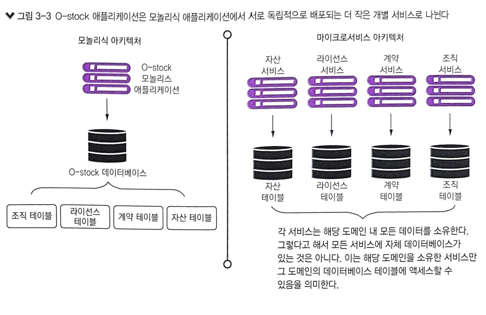

# 스프링 마이크로서비스 코딩 공작소

도서 및 Github [코드](https://github.com/gilbutITbook/080283) 를 참조하여 Kotlin으로 프로젝트를 실습하고, 각 chapter 별로 내용을 정리합니다.

목차

- [스프링 마이크로서비스 코딩 공작소](#스프링-마이크로서비스-코딩-공작소)
  - [환경 및 설정](#환경-및-설정)
  - [코드 실습](#코드-실습)
    - [Chapter1](#chapter1)
  - [도서 챕터별 정리](#도서-챕터별-정리)
    - [1장 스프링, 클라우드와 만나다](#1장-스프링-클라우드와-만나다)
    - [2장 스프링 클라우드와 함께 마이크로서비스 세계 탐험](#2장-스프링-클라우드와-함께-마이크로서비스-세계-탐험)
    - [3장 스프링 부트로 마이크로서비스 구축하기](#3장-스프링-부트로-마이크로서비스-구축하기)
    - [4장 도커](#4장-도커)

## 환경 및 설정

환결 설정

- OpenJDK: 21.0.4(21.0.4-amzn Corretto)

도구

- Tool: IntelliJ Community 2024.02

API 테스트

- API: 모든 API는 Postman을 이용하여 테스트를 진행했습니다.
  해당 [import 파일](./docs/api/Book%20Spring%20Microservice%20API.postman_collection.json) 을 이용하여 API 동작 확인을 할 수 있습니다.

docs 폴더의 `Book Spring Microservice API.postman_collection.json` 파일을 Postman에 import를 하여 API 테스트를 하면 쉽게 할 수 있습니다.

## 코드 실습

### [Chapter1](https://github.com/haservi/book-spring-microservice-kotlin/tree/main/chapter1)

기본적인 API 동작을 확인할 수 있습니다. 스프링 Boot를 이용하여 REST API 호출부를 실습합니다.

## 도서 챕터별 정리

### 1장 스프링, 클라우드와 만나다

내용 정리(펼치기)

1.1 마이크로서비스 아키텍처로 진화

1. 모놀리스 아키텍쳐
    - 장점
    - 모든 UI, 비즈니스 및 데이터베이스 액세스 로직이 하나로 배포
    - 관리가 쉬움
    - 구축 및 배포가 쉬움
    - 변경 가능성이 낮은 경우 모놀리스로 시작하는게 좋음
        - 단점
    - 규모가 커지면 관리가 어려움

2. 마이크로서비스 아키텍쳐
    - 장점
    - 각 구성 요소는 작은 책임 영역을 담당하고 서로 독립적 배포
    - 잘 분해하고 분리하면 대규모 코드베이스에서 발생하는 전통적인 복잡성 문제를 해결하는데 도움이 됨
        - 단점
    - 잘 분해라고 분리하기가 어려움
    - 여러 저장소로 나누어지기 때문에 개인이 관리하기 힘듬(12 저장소 관리..)
    - CCOP(Complex, Consistency, Operation overhead, Performance) 문제점

1.4 이 책의 내용

- 마이크로서비스의 정의, 모범 사례 및 마이크로서비스 기반 구축을 위한 설계 고려 사항
- 마이크로서비스 기반 애플리케이션을 구축하면 안되는 경우(중요..)
- 도커의 정의 및 마이크로서비스 기반 애플리케이션 통합 방법
- 애플리케이션 지표를 만들고 모니터링 도구로 시각화 방법
- ELK 스택으로 애플리케이션 로그 관리 방법
- 배운 내용 활용하여 배포 파이프라인 구축 방법(CI/CD?)

1.5 클라우드 및 마이크로서비스 기반 애플리케이션

실습코드 참조 [코드](https://github.com/haservi/book-spring-microservice-kotlin/tree/main/chapter1)

클라우드 컴퓨팅에서는 여러 가지 서비스 모델

IaaS (Infrastructure as a Service)

- 설명: IaaS는 인프라를 서비스로 제공하는 모델로, 사용자에게 서버, 스토리지, 네트워크 등의 가상화된 자원을 제공. 사용자는 인프라의 운영 체제, 네트워크 설정 등을 직접 관리하지만, 물리적인 하드웨어는
  클라우드 제공자가 관리
- 예시: Amazon Web Services (AWS) EC2, Microsoft Azure, Google Cloud Platform (GCP)
- 특징: 유연성과 확장성이 뛰어나며, 자원을 필요에 따라 쉽게 추가하거나 제거할 수 있음

SaaS (Software as a Service)

- 설명: SaaS는 소프트웨어를 인터넷을 통해 제공하는 서비스 모델로, 사용자는 설치나 유지보수 없이 웹 브라우저나 애플리케이션을 통해 소프트웨어를 사용할 수 있음. 애플리케이션의 모든 관리와 업데이트는 서비스
  제공자가 수행
- 예시: Google Workspace (Gmail, Google Docs), Salesforce, Microsoft 365
- 특징: 사용자가 소프트웨어를 직접 설치하거나 관리할 필요가 없고, 언제 어디서나 인터넷 연결만 있으면 접근 가능

PaaS (Platform as a Service)

- 설명: PaaS는 개발자들이 애플리케이션을 개발하고 배포할 수 있는 플랫폼을 제공. 이 플랫폼은 운영 체제, 미들웨어, 데이터베이스 관리 시스템 등을 포함하며, 개발자가 인프라 관리 없이 애플리케이션 개발에
  집중할 수 있음
- 예시: Google App Engine, Microsoft Azure App Service, Heroku
- 특징: 개발 환경을 빠르게 설정하고 관리할 수 있어 개발 시간을 단축하고, 복잡한 인프라 운영을 클라우드 제공자가 처리

CaaS (Container as a Service)

- 설명: CaaS는 컨테이너화된 애플리케이션을 배포하고 관리할 수 있는 환경을 제공. Docker와 Kubernetes와 같은 컨테이너 오케스트레이션 도구를 사용하여 애플리케이션을 쉽게 배포하고 확장할 수 있음
- 예시: Amazon ECS, Google Kubernetes Engine (GKE), Microsoft Azure Kubernetes Service (AKS)
- 특징: 컨테이너 기반 애플리케이션의 빠른 배포와 확장성이 용이하며, DevOps 환경에서 특히 유용

FaaS (Function as a Service)

- 예시: AWS Lambda, Google Cloud Functions, Azure Functions.
- 설명: FaaS는 이벤트 기반으로 특정 기능(코드)을 실행할 수 있는 서버리스 컴퓨팅 모델. 사용자는 코드를 작성하고 업로드하면, 서비스 제공자가 이를 실행하고 필요할 때만 비용이 발생. 인프라와 서버 관리를
  하지 않아도 되며, 트리거 기반으로 애플리케이션이 작동
- 특징: 서버리스 환경으로, 특정 이벤트에 반응하여 실행되며, 애플리케이션 규모가 유동적일 때 유리

DaaS (Desktop as a Service)

- 설명: DaaS는 가상 데스크탑 환경을 클라우드에서 제공하는 서비스. 사용자는 클라우드 상에서 가상 데스크탑에 접속하여 업무를 수행할 수 있으며, 데스크탑의 운영 체제 및 애플리케이션도 클라우드에서 관리
- 예시: Amazon WorkSpaces, VMware Horizon Cloud
- 특징: 물리적인 PC 없이도 언제 어디서나 데스크탑 환경에 접근할 수 있으며, 보안 관리 및 업데이트가 중앙에서 이루어짐

1.6 마이크로서비스는 코드 작성 이상을 의미한다.

견고한 서비스를 작성하려면 아래와 같이 여러 가지 주제를 고려해야 함

- 적정 규모: 서비스가 한 가지 책임 영역에 집중되도록 하려면 어떻게 해야 하는가?
- 마이크로서비스가 너무 많은 책임을 지지 않도록 적절한 마이크로서비스 크기를 유지하는 방법
- 위치 투명성: 서비스 호출에 대한 물리적 상세 정보를 관리하는 방법. 마이크로서비스 애플리케이션에서 다수의 서비스 인스턴스가 빠르게 시작하고 종료
- 회복성: 실패한 서비스를 우회하고 빠른 실패 방식을 적용하여 마이크로서비스 소비자와 애플리케이션의 전반적인 무결성을 보호하는 방법
- 반복성: 서비스의 모든 새 인스턴스가 시작할 떄 운영 환경의 다른 서비스와 동일한 구성과 코드베이스를 보장하는 방법
- 확장성: 서비스 간 직접적인 종속 관계를 최소화하고 마이크로서비스를 적절히 확장할 수 있도록 통신 방식을 구축하는 방법
- 핵심 마이크로서비스 개발, 라우팅, 클라이언트 탄력성, 보안, 로깅 및 추적, 애플리케이션 지표, 빌드 및 배포 패턴

1.7 핵심 마이크로서비스 개발 패턴

  

- 서비스 세분성: 서비스를 서로 다른 비즈니스 문제 도메인의 책임과 중첩될 정도로 지나치게 크게 나누면 시간이 지나 유지 관리하고 변경하기 어려움
- 통신 프로토콜: 동기 프로토콜의 경우 HTTP 기반 REST가 일반적인 통신이며, 비동기 프로토콜의 경우 아파치 카프카, RabbitMQ, AMQP 등을 사용
- 인터페이스 설계: 서비스 인터페이스 설계 및 서비스를 어떻게 구조화 하는게 좋을 지(2장에서 다룰 예정)
- 서비스 구성 관리: 클라우드에 있는 서로 다른 환경 간 마이크로서비스의 구성을 호환하려면 어떻게 구성 관리 해야하는지 (5장에서 다룰 예정)
- 서비스 간 이벤트 처리: 서비스간 의존성을 최소화하고 애플리케이션의 탄력성을 높이고자 이벤틀르 사용하여 서비스를 분리하는 방법은 어떻게 하는지(10장에서 다룰 예정(스프링 클라우드 스트림))

1.8 마이크로서비스 라우팅 패턴

마이크로서비스 라우팅 패턴은 마이크로서비스를 사용하려는 클라이언트 애플리케이션이 서비스 위치를 발견하고 서비스로 라우팅하는 방법에 관한 방법

- 서비스 디스커버리: 6장에서 자세히 다룰 예정이며, 서비스 디스커버리는 클라이언트 대응 서비스가 아니라 내부 서비스임을 기억하는게 좋음
- 서비스 라우팅: API 게이트웨이를 사용하면 모든 서비스에 대한 단일 진입점을 제공하여 마이크로서비스 애플리케이션의 여러 서비스와 서비스 인스턴스에 대해 일관된 보안 정책과 라우팅 규칙을 적용할 수 있음(8장에서
  자세히 다룰 예정)

1.9 마이크로서비스 클라이언트 회복성

서비스 문제 발생 시 연쇄적으로 서비스 소비자까지 전파되는 것을 막는 것이 중요합니다. 이와 관련된 4가지의 클라이언트 회복성 패턴

- 클라이언트 부하 분산: 여러 인스턴스에 대한 호출이 정상 인스턴스에 분산되도록 서비스 인스턴스 위치를 캐싱하는 방법
- 회로 차단기 패턴: 문제가 있는 서비스 호출하지 않는 방법
- 폴백 패턴: 마이크로서비스 호출 실패 시 다른 서비스 클라이언트가 작업을 수행하도록 플러그인 메커니즘을 제공하는 방법
- 벌크헤드 패턴: 한 서비스의 오작동 호출이 애플리케이션의 다른 곳에 나쁜 영향을 미치지 않도록 호출을 격리하는 방법

1.10 마이크로서비스 보안 패턴

적절한 자격 증명을 가진 승인된 요청만 서비스를 호출할 수 있도록 할 수 있는 3가지의 보안 패턴 방법

- 인증: 서비스를 호출하는 서비스 클라이언트가 누구인지 확인하는 방법
- 인가(권한 부여): 서비스 클라이언트가 수행하려는 행동에 대한 수행 자격 여부를 확인하는 방법
- 자격 증명 관리와 전파: OAuth2와 JWT 같은 토큰 기반의 보안 표준 사용 방법

1.11 마이크로서비스 로깅과 추적 패턴

마이크로서비스 아키텍처의 단점은 간단한 동작 하나에 수많은 마이크로서비스 호출이 발생하여 문제를 디버깅하고 추적 및 모니터링하기가 매우 어려움  
이를 해결하기 위해 분산 추적을 달성하는 세 가지 핵심 로깅 및 추적 패턴

- 로그 상관관계: 한 트랜잭션에 대해 여러 서비스에서 생서된 모든 로그를 함께 연결하는 상관관계 ID(correlation ID)를 구현하는 방법
- 로그 수집: 마이크로서비스가 출력한 모든 로그를 수집하여 확인하는 방법
- 마이크로서비스 추적: 트랜잭션과 관련된 모든 서비스 간 클라이언트 트랜잭션 흐름을 시각화하고 성능 특성을 살펴보는 방법

1.12 애플리케이션 지표 패턴

애플리케이션 지표 패턴은 애플리케이션이 지표를 모니터링 하는 방법과 애플리케이션의 가능한 실패 원인을 경고하는 방법

해당 패턴은 서비스의 잠재적인 성능 문제를 방지하고자 지표 서비스가 비즈니스와 연관된 데이터를 수집, 저장, 질의하는 방법을 보여줌

- 지표: 애플리케이션 상태에 대해 중요한 정보를 생성하고 이 정보의 지표를 노출하는 방법
- 지표 서비스: 애플리케이션 지표를 저장하고 질의하는 곳
- 지표 시각화 제품군: 애플리케이션과 인프라스트럭처에 대해 비즈니스와 연관된 시계열 데이터를 시각화

  

**지표 모니터링은 마이크로서비스 아키텍처에 필수적**이며, 마이크로서비스의 높은 분산성으로 인해 모놀리식 구조보다 더 높은 경향이 있음(복잡하고 어렵다?)

1.13 마이크로서비스 빌드/배포 패턴

마이크로서비스 아키텍처의 핵심 부분 중 하나는 한 마이크로서비스의 각 인스턴스가 모두 동일해야 함

서버가 배포된 후 서버의 변경 사항으로 발생되는 구성 불일치는 애플리케이션의 안정성을 해칠 수 있어 발생을 막아야 함

빌드 및 배포 파이프라인을 구축하는 방법

- 빌드 및 배포 파이프라인: 조직의 모든 환경에서 원 버튼 클릭 빌드와 배포를 중시하는 반복적인 빌드 및 배포 프로세스를 구축하는 방법
- 코드형 인프라스트럭처: 소스 제어로 실행되고 관리되는 서비스 프로비저닝 처리 방법
- 불변 서버: 마이크로서비스 이미지가 생성되고 배포된 후 절대 변경되지 않도록 하는 방법
- 피닉스 서버: 개별 컨테이너를 실행하는 서버가 정기적으로 분해되어 불변 이미지로 재생성되도록 하는 방법

### 2장 스프링 클라우드와 함께 마이크로서비스 세계 탐험

내용 정리(펼치기)

2.1 스프링 클라우드란?

스프링 클라우드(Spring Cloud)는 마이크로서비스 아키텍처(Microservices Architecture)를 쉽게 구현하고 관리할 수 있도록 돕는 스프링 프레임워크의 확장 모듈

마이크로서비스는 애플리케이션을 여러 독립적인 서비스로 분리하는 방식인데, 이 방식에서는 각각의 서비스가 개별적으로 배포되고 유지보수

스프링 클라우드는 이러한 분산 시스템에서 공통적으로 발생하는 문제들을 해결하는 다양한 도구와 라이브러리를 제공

주요 기능

- 서비스 디스커버리: 분산된 여러 서비스들이 서로를 찾고 통신할 수 있도록 도와주며, Eureka 같은 서비스가 대표적
- 분산형 구성 관리: 여러 서비스에서 공통으로 사용하는 설정 값을 중앙에서 관리하고 배포할 수 있으며, Spring Cloud Config를 통해 이를 구현할 수 있음
- 로드 밸런싱: 서비스 간 요청을 분산시키는 로드 밸런싱 기능을 제공 하며, Ribbon이나 Spring Cloud LoadBalancer 같은 도구가 사용
- API Gateway: 모든 마이크로서비스를 하나의 진입점(API Gateway)에서 관리하고, 각 서비스에 대한 라우팅 및 보안 정책을 정의할 수 있으며, Zuul이나 Spring Cloud Gateway가
  이를 처리
- 분산 추적: 서비스 간의 호출 및 상태를 추적 및 스프링 클라우드 슬루스(Spring Cloud Sleuth)를 통해 분산된 로깅과 트레이싱을 제공하며, ELK 스택 등 로깅 집계 기술 도구와 집킨 등 추적
  도구와 결합될 때 더 효용성이 있음
- 서킷 브레이커: 마이크로서비스 간의 의존성 문제가 발생할 때, 시스템 전체가 중단되는 것을 방지하는 서킷 브레이커 패턴을 지원하며, 이를 통해 문제가 있는 서비스에 대한 호출을 빠르게 중단하고, 시스템의 안정성을
  유지할 수 있습니다. Hystrix와 같은 도구가 사용

주요 컴포넌트

- Spring Cloud Netflix: 넷플릭스가 만든 마이크로서비스 도구 모음을 포함하며, Eureka, Hystrix, Ribbon 등의 도구들이 포함
- Spring Cloud Gateway: 경량화된 API 게이트웨이 역할을 하며, 요청 라우팅, 보안, 필터링 등의 기능을 제공
- Spring Cloud Config: 중앙화된 설정 관리 시스템을 제공

장점

- 확장성: 애플리케이션을 독립적인 서비스로 나누어 개발, 배포 및 확장이 용이
- 유연성: 다양한 클라우드 서비스나 인프라와 쉽게 연동 가능
- 관찰 가능성(Observability): 분산된 서비스들을 추적하고 모니터링하기 위한 다양한 툴을 제공해 서비스 상태를 쉽게 파악할 수 있음

2.2 스프링 클라우드 예제 소개

실제로 예제 실습은 하지 않지만, @EnableEurekaClient 애너테이션에 대한 기능을 설명함

@EnableEurekaClient는 Spring Cloud Netflix 프로젝트의 어노테이션 중 하나로, Spring Boot 애플리케이션을 Eureka 클라이언트로 등록하기 위해 사용

이를 통해 애플리케이션이 Eureka 서버에 자신의 정보를 등록하고, 다른 서비스들이 Eureka 서버를 통해 이 애플리케이션을 찾을 수 있음

주요 기능

- 서비스 등록: @EnableEurekaClient는 애플리케이션이 시작될 때 자동으로 Eureka 서버에 자신을 등록하며, 이렇게 등록된 애플리케이션은 다른 마이크로서비스들이 해당 애플리케이션의 위치(IP, 포트
  등)를 찾을 수 있도록 Eureka 서버에 정보가 저장
- 서비스 디스커버리: Eureka 클라이언트는 다른 마이크로서비스들의 정보를 조회할 수 있으며, 이를 통해 서로 위치를 몰라도 네트워크 상에서 서비스 간의 통신이 가능
- 부하 분산: 여러 인스턴스가 같은 서비스를 제공할 때, Eureka 클라이언트는 부하를 분산하여 처리할 수 있습니다. Eureka 서버에서 여러 인스턴스 중 하나를 선택하여 호출

2.3 클라우드 네이티브 마이크로서비스 구축 방법

클라우드 네이티브: 클라우드 네이티브 애플리케이션은 클라우드 컴퓨팅 아키텍처의 모든 이점과 서비스를 활용할 수 있도록 특별히 설계됨

클라우드 네이티브 개발을 위한 네 가지 원칙

- 데브옵스는 개발과 운영의 약어로 개발자와 IT 운영 간 커뮤니케이션과 협업, 통합에 중점을 둔 소프트웨어 개발 방법론을 의미
- 마이크로서비스는 작고, 느근하게 결합된 분산 서비스
- 지속적 전달(CD(continuous delivery))은 소프트웨어 개발 관행
- 컨테이너는 가상 머신 이미지에 마이크로서비스를 배포하는 자연스러운 확장

12-Factor 애플리케이션은 현대 클라우드 네이티브 애플리케이션을 설계할 때 따를 수 있는 12가지의 모범 사례를 정의한 방법론입니다.

특히 확장성, 유지보수성, 이식성을 높이기 위해 만들어졌으며, 특히 마이크로서비스나 클라우드 환경에서 많이 사용됩니다.

12-Factor 애플리케이션의 모범 사례 정보

1. 코드베이스 (Codebase)
   여러 배포를 포함한 하나의 코드베이스: 모든 애플리케이션은 하나의 코드베이스에 의존하고, 그 코드베이스는 여러 환경(예: 개발, 테스트, 프로덕션)에서 배포될 수 있으며, 여러 애플리케이션이 동일한 코드를
   공유하거나, 단일 코드베이스에서 다수의 앱이 나오는 상황은 피해야 함

2. 종속성 관리 (Dependencies)
   명시적 선언과 격리: 외부 라이브러리나 패키지 등 모든 종속성은 package manager 등을 통해 명시적으로 선언해야 하며, 시스템에 의존하지 않고 애플리케이션 자체에 포함되도록 격리

3. 설정 (Config)
   설정과 코드의 분리: 애플리케이션의 설정 값(예: 데이터베이스 URL, API 키 등)은 코드와 분리되어 환경 변수로 관리되어야 하며, 배포 환경에 맞춰 쉽게 변경될 수 있어야 함

4. 백엔드 서비스 (Backing Services)
   백엔드 서비스는 외부 리소스로 취급: 데이터베이스, 메시지 큐, 캐시 서버 등은 외부 서비스로 간주하며, 쉽게 교체 가능해야 하며, 설정을 통해 서비스 위치를 정의하고, 내부에 종속되지 않게 설계 필요

5. 빌드, 릴리스, 실행 (Build, Release, Run)
   빌드, 릴리스, 실행을 분리: 애플리케이션의 빌드, 릴리스, 실행 과정을 각각 분리 빌드는 소스 코드를 컴파일하고 패키징하며, 릴리스는 빌드된 파일을 설정과 함께 결합하여 실행할 수 있는 단위로 만들어야 함

6. 프로세스 (Processes)
   무상태 프로세스로 설계: 애플리케이션은 무상태(stateless)로 설계되어야 하며, 모든 상태는 데이터베이스나 외부 저장소에 저장해야 하며, 프로세스는 언제든지 시작되고 중단될 수 있어야 됨

7. 포트 바인딩 (Port Binding)
   포트를 바인딩해 서비스 제공: 애플리케이션은 웹 서버와 같은 외부 도구 없이 자체적으로 포트를 통해 서비스를 제공해야 하며, 애플리케이션 자체가 웹 서버 역할을 하도록 설계

8. 동시성 (Concurrency)
   프로세스 모델을 통한 확장: 애플리케이션은 여러 프로세스로 수평 확장이 가능해야 하며, 프로세스는 독립적으로 실행되어야 함

9. 폐기 가능성 (Disposability)
   빠르게 시작하고, 안전하게 종료: 애플리케이션의 프로세스는 빠르게 시작하고, 신속하고 안전하게 종료될 수 있어야 하며, 갑작스러운 종료도 대비해야 하며, 이는 시스템의 유연성을 높입니다.

10. 개발/프로덕션 일치 (Dev/Prod Parity)
    개발, 테스트, 프로덕션 환경을 최대한 유사하게 유지: 개발 환경과 프로덕션 환경의 차이를 최소화하여 배포 전후의 문제를 방지해야 하며, 이를 통해 개발 시 발견하지 못한 문제를 프로덕션에서 발견하는 일을
    줄일 수 있음

11. 로그 (Logs)
    이벤트 스트림으로 취급: 애플리케이션의 로그는 파일에 저장하지 않고 표준 출력으로 처리되며, 로그 처리는 외부 도구에 위임(ex: ELK)해야함

12. 관리 프로세스 (Admin Processes)
    관리 및 유지보수 작업을 일회성 프로세스로 실행: 데이터베이스 마이그레이션이나 배치 작업 같은 관리 작업은 일회성 프로세스로 실행되며, 애플리케이션의 주 프로세스와 분리된 독립적인 환경에서 실행

2.4 적절한 예제 도입

기본적으로 @springBootApplication은 아래와 같이 순서로 해당 프로젝트의 애노테이션 정보를 찾습니다.

아래와 같이 `ClassPathScanningCandidateComponentProvider.Java`는 내부 로직에서 아래 함수에서 @Repository, @Service, @Controller를 찾아서
추가됩니다.

### 3장 스프링 부트로 마이크로서비스 구축하기

내용 정리(펼치기)

3.1 아키텍트 이야기: 마이크로서비스 아키텍처 설계

1. 비즈니스 문제 분해: 복잡한 문제는 관리 가능한 덩어리로 쪼개는 것이 좋음(마이크로서서비스 아케턱처도 이와 유사함)

2. 서비스 세분화 확정:애플리케이션에 필요한 마이크로서비스를 정의하는 과정

   

   서비스 세분화를 할 때 올바르게 세분화 수준을 정의 하는 개념들

    - 마이크로서비스는 광범위하게 시작하고 더 작은 서비스로 리팩터링하는 것이 좋다
    - 서비스 간 교류하는 방식에 중점을 둔다
    - 문제 도메인에 이해가 깊어지면서 서비스 책임도 계속 변한다

   나쁜 마이크로서비스의 징후

    - 너무 큰 마이크로서비스 징후
        - 책임이 너무 많은 서비스
        - 다수 테이블에 걸쳐 데이터를 관리하는 서비스
            - 각각의 마이크로서비스는 3~5개 이하의 테이블을 소유하는 것이 적당(저자 의견)
        - 테스트가 너무 많은 서비스
    - 너무 작은 마이크로서비스 징후
        - 마이크로서비스가 지나치게 상호 의존적
        - 마이크로서비스가 단순한 CRUD 서비스 집합이 된 경우
        - 문제 도메인의 한 부분에 속한 마이크로서비스가 늘어난 경우

3. 서비스 인터페이스 설계

   마이크로서비스로 비즈니스 로직을 구축할 때 서비스의 인터페이스는 직관적이어야 하며, 일반적으로 아래와 같은 서비스 인터페이스 설계 지침을 사용할 수 있습니다.

    - REST 철학 수용
    - URI를 사용하여 의도를 전달
    - 요청과 응답에 JSON을 사용
    - HTTP 상태 코드로 결과를 전달

3.2 마이크로서비스를 사용하지 말아야 할 때

마이크로서비스를 사용하면 안되는 경우는 아래와 같습니다.

1. 분산 시스템 구축의 복잡성

    - 모놀로식에 비해 복잡성이 높으며, 높은 운영 성숙도가 필요
    - 자동화와 운영 작업(모니터링, 확장 등)에 투자하기 어려운 경우

2. 서버 또는 컨테이너 스프롤

    - 마이크로서비스의 가장 일반적인 배포 모델은 컨테이너당 하나의 마이크로서비스 인스턴스를 배포
    - 스프롤은 활용도가 낮은 여러 서버가 실제 작업량보다 더 많은 공간과 리소를 차지하는 현상

3. 애플리케이션 타입

    - 소규모 애플리케이션이나 적은 사용자 기반의 애플리케이션과 맞지 않음

4. 데이터 트랜잭션과 일관성

    - 서비스와 서비스 소비자의 데이터 사용 패턴을 충분히 생각해야 함
    - 여러 데이터 소스를 걸쳐 복잡한 데이터를 집계하고 반환하는 경우 마이크로서비스의 특성상 어려움이 발생함
    - 성능 문제도 해결이 어려울 수 있음

3.3 개발자 이야기: 스프링 부트와 자바

3.3.1 마이크로서비스 출입구 만들기: 스프링 부트 컨트롤러

- 모든 예제는 REST 형식이며, 아래와 같이 모든 서비스에 특징이 있음
    - HTTP/HTTPS를 서비스에 대한 호출 프로토콜로 사용
    - 서비스 동작은 표준 HTTP 동사에 매핑(POST, GET, PUT, DELETE)
    - 서비스 출력 데이터의 직렬화 형식으로 JSON을 사용
    - 서비스 호출 상태를 전달하는데 HTTP 상태 코드 사용

- 스프링에서 직렬화 및 역직렬화
    - implementation 'org.springframework.boot:spring-boot-starter-web' 위의 의존성을 추가하면 Jackson 라이브러리를 함께 가져옴
    - Jackson 라이브러리 안에 있는 ObjectMapper를 사용해 자바 객체를 JSON으로 직렬화, 혹은 JSON을 자바 객체로 역직렬화
    - 그렇기에 Request나 Response 클래스에서 @JsonIgnore @JsonCreator 애노테이션으로 요청과 응답을 디테일하게 제어가능
- ResponseEntity 반환 객체에는 상태 코드, 헤더, 바디를 포함한 HTTP 응답을 나타낼 수 있음

- 엔드포인트 이름이 중요함
    - 서비스가표현하는 리소스에 명확(/api/v1/licenses)
    - URL을 사용해서 리소스 간 관계를 설정하라(GET /api/v1/organizations/{organizationId}/licenses)
    - URL 버전 체계를 일찍 세워라(/api/v1/licenses, /api/v2/licenses)

3.3.2 라이선싱 서비스에 국제화 추가하기

- 국제화는 애플리케이션을 다른 언어에 적응할 수 있도록 하는 필수 요구 사항
- messageSource.setUseCodeAsDefaultMessage(true)
    - 메시지를 찾을 수 없는 경우 Exception을 던지지않고 해당 key를 찾을 수 없다고 메시지 반환
- messageSource.setBasenames("messages")
    - /src/main/resources 에서 messages로 시작하는 언어를 찾아서 매핑해줌
- Accept-Language 헤더에서 언어를 수신 받아서 표현할 수 있음
    - 프런트엔드 애플리케이션이 로케일을 처리하는 경우, 컨트롤러 메서드에서 로케일을 매개변수로 입력받는 것이 가장 좋은 옵션
    - 백엔드에서 로케일을 관리한다면 디폴트 로케일을 사용할 수 있음

3.3.3 관령 링크를 표시하는 스프링 HATEOAS 구현

HATEOAS는 REST의 핵심 개념 중 하나로, API 응답에 하이퍼링크를 포함하여 클라이언트가 어떤 추가 작업을 할 수 있는지 동적으로 알려주는 방식

- HATEOAS 의존성을 추가하면 모델 클래스에 확장자로 RepresentaionModel<>을 추가할 수 있음
- 컨트롤러에서 해당 모델 클래스 linkTo() 메서드를 이용해 각 루트 매핑을 얻을 수 있음
- methodOn() 메서드는 대상 메서드에 더미 호출을 수행하여 메서드 매핑을 할 수 있음

3.4 데브옵스 이야기: 혹독한 런타임 구축

4가지 원칙을 갖고 마이크로서비스 개발을 시작 필요

- 마이크로서비스는 일체형
    - 하나의 소프트웨어 산출물로 시작 및 종료할 수 있는 서비스의 여러 인스턴스를 독립적으로 배포할 수 있어야 함
- 마이크로서비스는 구성 가능 해야 함
    - 필요한 구성 정보를 한곳에서 읽어 오거나 환경 변수로 전달받아야 함
- 마이크로서비스 인스턴스는 클라이언트에 투명해야 함
    - 클라이언트는 서비스의 정확한 위치를 알고 있어서는 안 된다
    - 인스턴스의 물리적 위치를 몰라도 인스턴스 위치를 찾을 수 있도록 마이크로서비스 클라이언트는 서비스 디스커버리 에이전트와 통신 해야 함
- 마이크로서비스는 자기 상태(health)를 전달해야 함
    - 마이크로서비스 인스턴스는 고장 날 수 있으며 디스커버리 에이전트는 고장난 인스턴스를 우회해서 라우팅해야 함

디스커버리 에이전트(Discovery Agent) 란

마이크로서비스 아키텍처에서 개별 서비스들이 서로를 찾고, 통신할 수 있게 도와주는 중요한 컴포넌트

주요 역할

- 서비스 등록
    - 새로운 마이크로서비스 인스턴스가 실행되면, 디스커버리 에이전트는 이를 서비스 디스커버리 시스템에 등록
    - 일반적으로 이 정보는 IP 주소와 포트 등 서비스에 대한 메타 데이터를 포함
- 서비스 조회
    - 다른 서비스들이 서로 통신하기 위해 디스커버리 에이전트를 통해 원하는 서비스의 위치(IP 및 포트)를 찾음
    - 서비스들은 고정된 위치 정보 없이도 동적으로 서로 연결할 수 있습
- 건강 상태 모니터링
    - 디스커버리 에이전트는 서비스의 상태를 모니터링하여 문제가 발생했을 때 서비스 레지스트리에서 제거하거나 재등록하는 작업을 수행

마이크로서비스를 빌드한 환경에 배포할 때마다 발생하는 표준 수명 주기의 4가지 원칙

- 서비스 조립
    - 동일한 서비스 코드와 런타임이 정확히 동일한 방식으로 배포되도록 반복성과 일관성을 보장하면서 서비스를 패키징하고 배포하는 방법
- 서비스 부트스트래핑
    - 사람의 개입 없이 모든 환경에서 빠르게 시작하고 배포할 수 있도록 런타임 코드에서 애플리케이션 코드와 환경별 구성 코드를 분리하는 방법
- 서비스 등록 및 디스커버리
    - 새로운 마이크로서비스 인스턴스가 배포될 때 애플리케이션 클라이언트가 새 서비스 인스턴스를 발견할 수 있는 방법
- 서비스 모니터링
    - 데브옵스 관점에서 마이크로서비스 인스턴스를 모니터링 해야하며 장애 발생 시 서비스 인스턴스를 우회해서 라우팅하고 종료되는 확인

3.4.1 서비스 조립: 마이크로서비스의 패키징과 배포

마이크로서비스는 각각 독립된 애플리케이션으로 패키징하고 배포됩니다.

- 패키징: 각 마이크로서비스는 독립적인 단위로 패키징됩니다. 예를 들어, Spring Boot에서는 JAR 파일이나 Docker 이미지로 패키징
- 배포: 각 서비스는 독립적으로 배포되며, 클라우드 환경 또는 컨테이너 오케스트레이션 툴(예: Kubernetes)에서 관리됨 이를 통해 특정 서비스만 개별적으로 업데이트하거나 확장할 수 있음

3.4.2 서비스 부트스트래핑: 마이크로서비스의 구성 관리

마이크로서비스는 각 서비스가 시작될 때 필요한 구성 정보를 받아와야 합니다.

- 구성 관리: Spring Cloud Config와 같은 도구를 사용하여 중앙화된 구성 서버에서 각 마이크로서비스의 설정 파일을 관리
- 환경별(개발, 테스트, 운영)로 설정을 일관되게 유지하면서도 변경 시 빠르게 반영할 수 있음
- 부트스트래핑: 서비스가 시작할 때 필요한 구성(환경변수, 데이터베이스 연결 정보 등)을 중앙 서버에서 가져와 적용하는 과정

3.4.3 서비스 등록과 디스커버리: 클라이언트가 마이크로서비스와 통신하는 방법

마이크로서비스는 동적으로 추가되거나 제거될 수 있으므로, 다른 서비스 또는 클라이언트가 이를 인식하고 통신할 수 있어야 합니다.

- 서비스 등록: 마이크로서비스가 시작될 때 Eureka 같은 서비스 디스커버리 서버에 자신을 등록
- 서비스 디스커버리: 클라이언트나 다른 서비스가 특정 마이크로서비스의 위치(IP/포트)를 찾을 때 디스커버리 서버에서 정보를 받아와 통신. 동적으로 서비스 위치를 찾을 수 있음

3.4.4 마이크로서비스 상태 전달

각 마이크로서비스는 자신의 상태(예: 헬스 체크, 성능 메트릭)를 모니터링하거나 공유해야 합니다.

- 상태 전달: 마이크로서비스는 Actuator 같은 도구를 사용하여 현재 상태(건강 상태, 자원 사용량)를 노출하고, 모니터링 시스템이 이를 확인
- 헬스 체크: 디스커버리 서버는 정기적으로 각 서비스의 상태를 체크하여 비정상적인 서비스를 등록 목록에서 제거하거나 경고를 보냄

Actuator 라이브러리 적용 후 API 호출 예시

3.5 모든 관점 통합하기

클라우드의 마이크로서비스를 성공적으로 하기 위해서는 아키텍트, 개발자, 데브옵스 엔지니어의 관점을 모아 통합 필요

- 아키텍트
    - 비즈니스 문제의 자연스러운 윤곽을 찾는 데 집중
    - 크게 나눈 마이크로서비스에서 시작하여 작은 서비스로 리팩터링하는 것이 낫다는 것을 기억
- 소프트웨어 엔지니어(개발자)
    - 서비스 안의 각 계층마다 책임이 분리된 계층화된 서비스를 구축하는 데 집중
    - 코드에서 프레임워크를 만들려는 유혹을 피하고 완전히 독립적인 마이크로서비스를 지향
- 데브옵스 엔지니어
    - 서비스의 수명 주기를 조기에 수립
    - 데브옵스 관점에서 서비스 빌드와 배포를 자동화하는 방법뿐 아니라 서비스 상태를 모니터링하고 문제가 발생할 때 대응하는 방법에도 주목
    - 서비스를 운영하는 것은 비즈니스 로직을 작성하는 것보다 더 많은 작업과 고려가 필요

### 4장 도커

내용 정리(펼치기)

- 도커 컨테이너를 사용하면 소프트웨어 개발을 한 플랫폼에서 다른 플랫폼으로 빠르고 유용한 방법으로 이전하고 실행할 수 있음
- 컨테이너를 마이크로서비스에 속도와 이식성, 확장성 같은 이점을 제공

4.1 컨테이너 또는 가상 머신?

마이크로서비스와 함께 컨테이너를 사용한다면 아래와 같은 이점을 얻을 수 있음

- 컨테이너는 어디에서나 실행할 수 있어 개발 및 구현이 용이하고 이식성을 높여줌
- 컨테이너는 다른 애플리케이션과 완전히 격리된 예측 가능한 환경을 생성해 주는 기능을 제공
- 컨테이너는 VM보다 더 빠르게 시작하고 중지할 수 있어 클라우드 네이티브가 가능
- 컨테이너는 확장 가능하고 자원 활용을 최적화하는 데 능동적으로 스케줄링 관리할 수 있음
    - 컨테이너 내부에서 실행되는 애플리케이션의 성능과 유지 보수성을 높임
- 최소 서버로 가능한 많은 애플리케이션을 실행할 수 있음

4.2 도커란?

- VM 등 다른 하드웨어 자원을 몰라도 물리 머신의 자원을 여러 컨테이너와 공유할 수 있음
- 컨테이너는 애플리케이션이 실행하는 데 필요한 모든 것을 제공하는 논리적 패키징 메커니즘을 의미

도커 엔진의 구성 요소

- 도커 데몬: 컨테이너의 실행과 관리 역할을 담당하는 백그라운드 서비스
- 도커 클라이언트: 명령어를 사용해 Docker 데몬과 상호작용하는 인터페이스
- 도커 이미지: 컨테이너를 실행하기 위한 불변의 템플릿
- 도커 컨테이너: 이미지의 실행 인스턴스, 애플리케이션을 독립된 환경에서 실행
- 도커 레지스트리: 이미지를 저장하고 공유하는 중앙 저장소
- 도커 네트워크: 컨테이너 간의 통신을 가능하게 하는 가상 네트워크 환경
- 도커 볼륨: 데이터를 영구적으로 저장하기 위한 메커니즘

4.3 Dockerfiles

Dockerfile은 도커 클라이언트가 이미지를 생성하고 준비하기 위해 호출하는 데 필요한 지시어와 명령어들이 포함된 단순한 테스트 파일

Dockerfile의 주요 명령어

- FROM: 베이스 이미지 설정
    - Docker 이미지의 기본 이미지를 지정(예: FROM ubuntu:20.04)
- RUN: 명령 실행
    - 컨테이너 내부에서 명령어를 실행하고 그 결과를 이미지에 반영(예: RUN apt-get update && apt-get install -y curl)
- CMD: 컨테이너 실행 시 기본으로 실행할 명령어 지정
    - 컨테이너가 실행될 때 실행할 기본 명령을 정의하며, CMD는 단일 명령만 설정(예: CMD ["npm", "start"])
- ENTRYPOINT: 컨테이너 실행 시 실행할 명령어 설정
    - 컨테이너가 실행될 때 항상 실행될 명령어를 정의하며, CMD와 달리 고정 명령을 설정하는 데 사용되며, 추가 인자를 전달할 수 있음(예:
      ENTRYPOINT ["java", "-jar", "-Dspring.profiles.active=prod", "/java.jar])
- COPY: 파일 복사
    - 로컬 파일을 Docker 이미지로 복사(예: COPY ./app /usr/src/app)
- WORKDIR: 작업 디렉토리 설정
    - 명령어 실행 시 기본 작업 디렉토리를 설정(예: WORKDIR /usr/src/app)
- ENV: 환경 변수 설정
    - Docker 컨테이너 내부에서 사용할 환경 변수를 정의(예: ENV APP_ENV production)
- EXPOSE: 포트 노출
    - 컨테이너가 사용하는 포트를 외부에 노출(예: EXPOSE 8080)
- VOLUME: 볼륨 마운트
    - 컨테이너 외부와 공유할 디렉토리를 정의(예: VOLUME ["/src"])

4.4 도커 컴포즈

도커 컴포즈는 서비스 설계와 구축이 용이한 스크립트를 작성하여 도커를 더 쉽게 사용할 수 있으며, 도커 컴포즈를 사용하면 여러 컨테이너를 하나의 서비스로 실행하거나 다른 컨테이너를 동시에 생성할 수 있습니다.

도커 컴포즈 지시어

- version: Docker Compose 파일의 버전을 정의
- services: 여러 컨테이너(서비스)를 정의하는 섹션
- image: 특정 이미지를 사용하여 컨테이너를 실행하도록 지정
- port: 시작한 도커 컨테이너가 외부에 노출할 포트 번호를 지정 8080(외부):80(내부)
- environment: 시작하는 도커 이미지에 환경 변수를 전달
- networks: 컨테이너들이 소속될 네트워크를 정의(기본 bridge)

도커 컴포즈 명령어

- docker-compose up: docker-compose.yml 파일을 기반으로 모든 서비스 빌드 및 시작
- docker-compose ps : 시스템에 배포한 모든 컨테이너 목록 출력
- docker-compose down: 실행 중인 모든 서비스를 중지하고, 관련된 네트워크 및 볼륨 삭제
- docker-compose stop: 실행 중인 모든 서비스를 중지
- docker-compose build: 중지된 서비스 시작
- docker-compose logs <service_id>: 최신 배포 로그 또는 특정 서비스 로그 출력

4.5 마이크로서비스와 도커 통합하기

예제를 이용하여 Docker, 스프링부트 빌드팩, docker-compose 학습합니다.

4.5.1 도커 이미지 만들기

기본 Dockerfile: 단일 단계로 이미지를 빌드합니다. 즉, 애플리케이션의 빌드와 실행을 하나의 Docker 이미지를 통해 처리됩니다.

장점

- 구현이 간단: 한 번에 빌드하고 실행하기 때문에 복잡한 설정이 필요하지 않음
- 쉽고 직관적: Dockerfile 작성이 간편

단점

- 이미지 크기 큼: 빌드 도구, 라이브러리, 소스코드 등 모든 것을 포함하여 최종 이미지가 커질 수 있음
- 불필요한 파일 포함: 소스 코드나 빌드 도구 등 실행에 필요 없는 파일도 최종 이미지에 포함될 수 있음

멀티스테이지 빌드 Dockerfile: 멀티스테이지 빌드는 여러 단계를 거쳐 이미지를 빌드합니다. 빌드 단계와 최종 실행 단계를 분리하여 최종 이미지에는 실행에 필요한 파일들만 포함시킵니다.

장점

- 이미지 크기 작음: 빌드에 사용된 도구(예: Gradle, 소스코드)는 최종 이미지에 포함되지 않으므로 이미지 크기를 줄일 수 있음
- 보안 향상: 불필요한 파일이나 도구가 포함되지 않아 보안 위험 감소
- 효율적: 실행에 필요한 것만 포함하므로 더 가볍고 배포가 빠름

단점

- 구현 복잡성: 여러 단계를 작성해야 하므로 Dockerfile이 조금 더 복잡해질 수 있음
- 빌드 시간이 더 길어질 수 있음: 모든 단계를 명확히 정의해야 하므로, 빌드 과정이 다소 길어질 수 있음

4.5.2 스프링 부트로 도커 이미지 생성하기

스프링부트 내부에서 이미지를 생성할 수 있게 합니다. 도커가 활성화 된 상태에서 스프링 부트 v2.3 이상인 경우 생성가능합니다.

빌드팩은 애플리케이션 및 프레임워크 의존성을 제공하는 도구로, 소스 코드를 실행 가능한 애플리케이션 이미지로 변환할 수 있습니다.

4.5.3 도커 컴포즈로 서비스 실행하기

실습 예제를 이용해 docker-compose.yml의 여러 서비스를 동시에 제어할 수 있습니다.

도커 실행 관련 명령어(컨테이너, 이미지, 볼륨, 네트워크, 시스템 관리)

- docker run 이미지이름: 컨테이너 생성 및 실행
- docker ps: 실행 중인 컨테이너 목록 보기
- docker stop 컨테이너ID: 컨테이너 중지
- docker start 컨테이너ID: 중지된 컨테이너 시작
- docker rm 컨테이너ID: 컨테이너 삭제
- docker exec 컨테이너ID: 컨테이너에서 명령 실행
- docker pull 이미지이름: 이미지 다운로드
- docker build -t 이미지이름 .: 이미지 빌드
- docker images: 이미지 목록 보기
- docker rmi 이미지ID: 이미지 삭제
- docker volume create 볼륨이름: 볼륨 생성
- docker volume ls: 볼륨 목록 보기
- docker volume rm 볼륨이름: 볼륨 삭제
- docker network create 네트워크이름: 네트워크 생성
- docker network ls: 네트워크 목록 보기
- docker network rm 네트워크이름: 네트워크 삭제
- docker logs: 컨테이너 로그 보기
- docker stats: 컨테이너 리소스 사용량 보기
- docker system prune: 불필요한 데이터 정리

도커 명령어 옵션

- -d: 백그라운드에서 컨테이너 실행. 컨테이너가 백그라운드에서 실행되며, 콘솔을 점유하지 않음(예: docker run -d myimage)
- -p: 포트 매핑. 호스트의 포트를 컨테이너 내부 포트와 연결(예: docker run -p 8080:80 myimage)
- --rm: 컨테이너 종료 시 삭제. 컨테이너가 종료되면 자동으로 삭제(예: docker run --rm myimage)
- --name: 컨테이너 이름 설정. 실행되는 컨테이너에 특정 이름을 지정(예: docker run --name mycontainer myimage)
- -v: 볼륨 마운트. 호스트의 디렉토리나 파일을 컨테이너 내부에 마운트(예: docker run -v /host/path:/container/path myimage)
- --env or -e: 환경 변수 설정. 컨테이너 실행 시 환경 변수를 설정(예: docker run -e "ENV_VAR=value" myimage)
- --network: 네트워크 설정. 컨테이너를 특정 네트워크에 연결(예: docker run --network my_network myimage)
- --entrypoint: 기본 실행 명령을 변경. 컨테이너 시작 시 기본적으로 실행되는 명령을 재정의(예: docker run --entrypoint /bin/bash myimage)
- -it: 인터랙티브 모드 및 TTY 사용. 컨테이너의 쉘로 진입하여 직접 명령을 실행(예: docker run -it myimage /bin/bash)
- --cpu: CPU 리소스 제한. 컨테이너가 사용할 수 있는 CPU 리소스를 제한(예: docker run --cpu-shares=512 myimage)
- --memory or -m: 메모리 사용량 제한. 컨테이너가 사용할 수 있는 최대 메모리 용량을 설정(예: docker run -m 512m myimage)
- --restart: 재시작 정책 설정. 컨테이너가 종료되었을 때 다시 시작할지 설정합니다.(예: docker run --restart always myimage)

