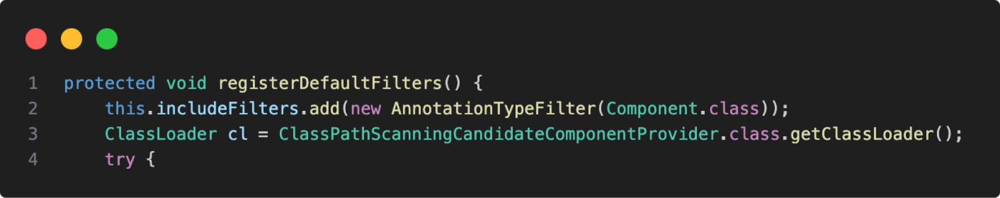

# 2장 스프링 클라우드와 함께 마이크로서비스 세계 탐험

## 2.1 스프링 클라우드란?

스프링 클라우드(Spring Cloud)는 마이크로서비스 아키텍처(Microservices Architecture)를 쉽게 구현하고 관리할 수 있도록 돕는 스프링 프레임워크의 확장 모듈

마이크로서비스는 애플리케이션을 여러 독립적인 서비스로 분리하는 방식인데, 이 방식에서는 각각의 서비스가 개별적으로 배포되고 유지보수

스프링 클라우드는 이러한 분산 시스템에서 공통적으로 발생하는 문제들을 해결하는 다양한 도구와 라이브러리를 제공

주요 기능

- 서비스 디스커버리: 분산된 여러 서비스들이 서로를 찾고 통신할 수 있도록 도와주며, Eureka 같은 서비스가 대표적
- 분산형 구성 관리: 여러 서비스에서 공통으로 사용하는 설정 값을 중앙에서 관리하고 배포할 수 있으며, Spring Cloud Config를 통해 이를 구현할 수 있음
- 로드 밸런싱: 서비스 간 요청을 분산시키는 로드 밸런싱 기능을 제공 하며, Ribbon이나 Spring Cloud LoadBalancer 같은 도구가 사용
- API Gateway: 모든 마이크로서비스를 하나의 진입점(API Gateway)에서 관리하고, 각 서비스에 대한 라우팅 및 보안 정책을 정의할 수 있으며, Zuul이나 Spring Cloud Gateway가
  이를 처리
- 분산 추적: 서비스 간의 호출 및 상태를 추적 및 스프링 클라우드 슬루스(Spring Cloud Sleuth)를 통해 분산된 로깅과 트레이싱을 제공하며, ELK 스택 등 로깅 집계 기술 도구와 집킨 등 추적
  도구와 결합될 때 더 효용성이 있음
- 서킷 브레이커: 마이크로서비스 간의 의존성 문제가 발생할 때, 시스템 전체가 중단되는 것을 방지하는 서킷 브레이커 패턴을 지원하며, 이를 통해 문제가 있는 서비스에 대한 호출을 빠르게 중단하고, 시스템의 안정성을
  유지할 수 있습니다. Hystrix와 같은 도구가 사용

주요 컴포넌트

- Spring Cloud Netflix: 넷플릭스가 만든 마이크로서비스 도구 모음을 포함하며, Eureka, Hystrix, Ribbon 등의 도구들이 포함
- Spring Cloud Gateway: 경량화된 API 게이트웨이 역할을 하며, 요청 라우팅, 보안, 필터링 등의 기능을 제공
- Spring Cloud Config: 중앙화된 설정 관리 시스템을 제공

장점

- 확장성: 애플리케이션을 독립적인 서비스로 나누어 개발, 배포 및 확장이 용이
- 유연성: 다양한 클라우드 서비스나 인프라와 쉽게 연동 가능
- 관찰 가능성(Observability): 분산된 서비스들을 추적하고 모니터링하기 위한 다양한 툴을 제공해 서비스 상태를 쉽게 파악할 수 있음

## 2.2 스프링 클라우드 예제 소개

실제로 예제 실습은 하지 않지만, @EnableEurekaClient 애너테이션에 대한 기능을 설명함

@EnableEurekaClient는 Spring Cloud Netflix 프로젝트의 어노테이션 중 하나로, Spring Boot 애플리케이션을 Eureka 클라이언트로 등록하기 위해 사용

이를 통해 애플리케이션이 Eureka 서버에 자신의 정보를 등록하고, 다른 서비스들이 Eureka 서버를 통해 이 애플리케이션을 찾을 수 있음

주요 기능

- 서비스 등록: @EnableEurekaClient는 애플리케이션이 시작될 때 자동으로 Eureka 서버에 자신을 등록하며, 이렇게 등록된 애플리케이션은 다른 마이크로서비스들이 해당 애플리케이션의 위치(IP, 포트
  등)를 찾을 수 있도록 Eureka 서버에 정보가 저장
- 서비스 디스커버리: Eureka 클라이언트는 다른 마이크로서비스들의 정보를 조회할 수 있으며, 이를 통해 서로 위치를 몰라도 네트워크 상에서 서비스 간의 통신이 가능
- 부하 분산: 여러 인스턴스가 같은 서비스를 제공할 때, Eureka 클라이언트는 부하를 분산하여 처리할 수 있습니다. Eureka 서버에서 여러 인스턴스 중 하나를 선택하여 호출

## 2.3 클라우드 네이티브 마이크로서비스 구축 방법

클라우드 네이티브: 클라우드 네이티브 애플리케이션은 클라우드 컴퓨팅 아키텍처의 모든 이점과 서비스를 활용할 수 있도록 특별히 설계됨

클라우드 네이티브 개발을 위한 네 가지 원칙

- 데브옵스는 개발과 운영의 약어로 개발자와 IT 운영 간 커뮤니케이션과 협업, 통합에 중점을 둔 소프트웨어 개발 방법론을 의미
- 마이크로서비스는 작고, 느근하게 결합된 분산 서비스
- 지속적 전달(CD(continuous delivery))은 소프트웨어 개발 관행
- 컨테이너는 가상 머신 이미지에 마이크로서비스를 배포하는 자연스러운 확장

12-Factor 애플리케이션은 현대 클라우드 네이티브 애플리케이션을 설계할 때 따를 수 있는 12가지의 모범 사례를 정의한 방법론입니다.

특히 확장성, 유지보수성, 이식성을 높이기 위해 만들어졌으며, 특히 마이크로서비스나 클라우드 환경에서 많이 사용됩니다.

12-Factor 애플리케이션의 모범 사례 정보

1. 코드베이스 (Codebase)
   여러 배포를 포함한 하나의 코드베이스: 모든 애플리케이션은 하나의 코드베이스에 의존하고, 그 코드베이스는 여러 환경(예: 개발, 테스트, 프로덕션)에서 배포될 수 있으며, 여러 애플리케이션이 동일한 코드를
   공유하거나, 단일 코드베이스에서 다수의 앱이 나오는 상황은 피해야 함

2. 종속성 관리 (Dependencies)
   명시적 선언과 격리: 외부 라이브러리나 패키지 등 모든 종속성은 package manager 등을 통해 명시적으로 선언해야 하며, 시스템에 의존하지 않고 애플리케이션 자체에 포함되도록 격리

3. 설정 (Config)
   설정과 코드의 분리: 애플리케이션의 설정 값(예: 데이터베이스 URL, API 키 등)은 코드와 분리되어 환경 변수로 관리되어야 하며, 배포 환경에 맞춰 쉽게 변경될 수 있어야 함

4. 백엔드 서비스 (Backing Services)
   백엔드 서비스는 외부 리소스로 취급: 데이터베이스, 메시지 큐, 캐시 서버 등은 외부 서비스로 간주하며, 쉽게 교체 가능해야 하며, 설정을 통해 서비스 위치를 정의하고, 내부에 종속되지 않게 설계 필요

5. 빌드, 릴리스, 실행 (Build, Release, Run)
   빌드, 릴리스, 실행을 분리: 애플리케이션의 빌드, 릴리스, 실행 과정을 각각 분리 빌드는 소스 코드를 컴파일하고 패키징하며, 릴리스는 빌드된 파일을 설정과 함께 결합하여 실행할 수 있는 단위로 만들어야 함

6. 프로세스 (Processes)
   무상태 프로세스로 설계: 애플리케이션은 무상태(stateless)로 설계되어야 하며, 모든 상태는 데이터베이스나 외부 저장소에 저장해야 하며, 프로세스는 언제든지 시작되고 중단될 수 있어야 됨

7. 포트 바인딩 (Port Binding)
   포트를 바인딩해 서비스 제공: 애플리케이션은 웹 서버와 같은 외부 도구 없이 자체적으로 포트를 통해 서비스를 제공해야 하며, 애플리케이션 자체가 웹 서버 역할을 하도록 설계

8. 동시성 (Concurrency)
   프로세스 모델을 통한 확장: 애플리케이션은 여러 프로세스로 수평 확장이 가능해야 하며, 프로세스는 독립적으로 실행되어야 함

9. 폐기 가능성 (Disposability)
   빠르게 시작하고, 안전하게 종료: 애플리케이션의 프로세스는 빠르게 시작하고, 신속하고 안전하게 종료될 수 있어야 하며, 갑작스러운 종료도 대비해야 하며, 이는 시스템의 유연성을 높입니다.

10. 개발/프로덕션 일치 (Dev/Prod Parity)
    개발, 테스트, 프로덕션 환경을 최대한 유사하게 유지: 개발 환경과 프로덕션 환경의 차이를 최소화하여 배포 전후의 문제를 방지해야 하며, 이를 통해 개발 시 발견하지 못한 문제를 프로덕션에서 발견하는 일을
    줄일 수 있음

11. 로그 (Logs)
    이벤트 스트림으로 취급: 애플리케이션의 로그는 파일에 저장하지 않고 표준 출력으로 처리되며, 로그 처리는 외부 도구에 위임(ex: ELK)해야함

12. 관리 프로세스 (Admin Processes)
    관리 및 유지보수 작업을 일회성 프로세스로 실행: 데이터베이스 마이그레이션이나 배치 작업 같은 관리 작업은 일회성 프로세스로 실행되며, 애플리케이션의 주 프로세스와 분리된 독립적인 환경에서 실행

## 2.4 적절한 예제 도입

기본적으로 @springBootApplication은 아래와 같이 순서로 해당 프로젝트의 애노테이션 정보를 찾습니다.

아래와 같이 `ClassPathScanningCandidateComponentProvider.Java`는 내부 로직에서 아래 함수에서 @Repository, @Service, @Controller를 찾아서
추가됩니다.

