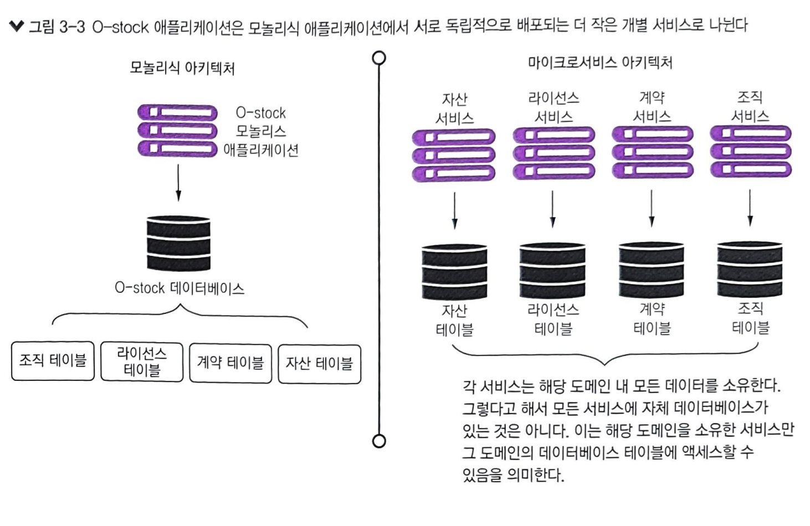
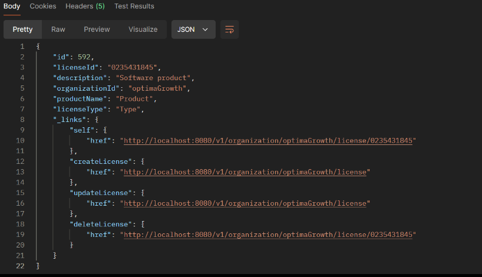
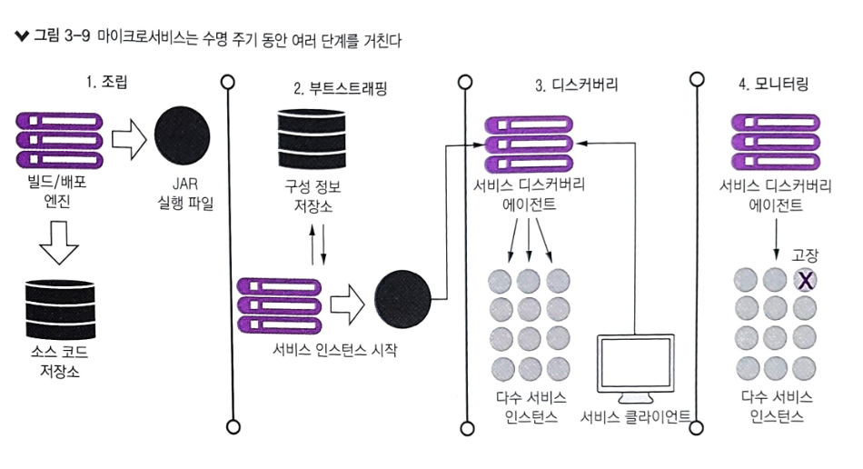
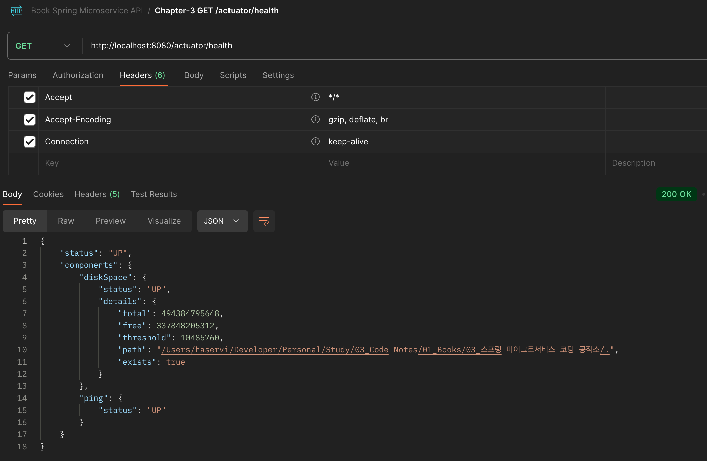

# 3장 스프링 부트로 마이크로서비스 구축하기

## 3.1 아키텍트 이야기: 마이크로서비스 아키텍처 설계

1. 비즈니스 문제 분해: 복잡한 문제는 관리 가능한 덩어리로 쪼개는 것이 좋음(마이크로서서비스 아케턱처도 이와 유사함)

2. 서비스 세분화 확정:애플리케이션에 필요한 마이크로서비스를 정의하는 과정

   

   서비스 세분화를 할 때 올바르게 세분화 수준을 정의 하는 개념들

    - 마이크로서비스는 광범위하게 시작하고 더 작은 서비스로 리팩터링하는 것이 좋다
    - 서비스 간 교류하는 방식에 중점을 둔다
    - 문제 도메인에 이해가 깊어지면서 서비스 책임도 계속 변한다

   나쁜 마이크로서비스의 징후

    - 너무 큰 마이크로서비스 징후
        - 책임이 너무 많은 서비스
        - 다수 테이블에 걸쳐 데이터를 관리하는 서비스
            - 각각의 마이크로서비스는 3~5개 이하의 테이블을 소유하는 것이 적당(저자 의견)
        - 테스트가 너무 많은 서비스
    - 너무 작은 마이크로서비스 징후
        - 마이크로서비스가 지나치게 상호 의존적
        - 마이크로서비스가 단순한 CRUD 서비스 집합이 된 경우
        - 문제 도메인의 한 부분에 속한 마이크로서비스가 늘어난 경우

3. 서비스 인터페이스 설계

   마이크로서비스로 비즈니스 로직을 구축할 때 서비스의 인터페이스는 직관적이어야 하며, 일반적으로 아래와 같은 서비스 인터페이스 설계 지침을 사용할 수 있습니다.

    - REST 철학 수용
    - URI를 사용하여 의도를 전달
    - 요청과 응답에 JSON을 사용
    - HTTP 상태 코드로 결과를 전달

## 3.2 마이크로서비스를 사용하지 말아야 할 때

마이크로서비스를 사용하면 안되는 경우는 아래와 같습니다.

1. 분산 시스템 구축의 복잡성

    - 모놀로식에 비해 복잡성이 높으며, 높은 운영 성숙도가 필요
    - 자동화와 운영 작업(모니터링, 확장 등)에 투자하기 어려운 경우

2. 서버 또는 컨테이너 스프롤

    - 마이크로서비스의 가장 일반적인 배포 모델은 컨테이너당 하나의 마이크로서비스 인스턴스를 배포
    - 스프롤은 활용도가 낮은 여러 서버가 실제 작업량보다 더 많은 공간과 리소를 차지하는 현상

3. 애플리케이션 타입

    - 소규모 애플리케이션이나 적은 사용자 기반의 애플리케이션과 맞지 않음

4. 데이터 트랜잭션과 일관성

    - 서비스와 서비스 소비자의 데이터 사용 패턴을 충분히 생각해야 함
    - 여러 데이터 소스를 걸쳐 복잡한 데이터를 집계하고 반환하는 경우 마이크로서비스의 특성상 어려움이 발생함
    - 성능 문제도 해결이 어려울 수 있음

## 3.3 개발자 이야기: 스프링 부트와 자바

### 3.3.1 마이크로서비스 출입구 만들기: 스프링 부트 컨트롤러

- 모든 예제는 REST 형식이며, 아래와 같이 모든 서비스에 특징이 있음
  - HTTP/HTTPS를 서비스에 대한 호출 프로토콜로 사용
  - 서비스 동작은 표준 HTTP 동사에 매핑(POST, GET, PUT, DELETE)
  - 서비스 출력 데이터의 직렬화 형식으로 JSON을 사용
  - 서비스 호출 상태를 전달하는데 HTTP 상태 코드 사용

- 스프링에서 직렬화 및 역직렬화
  - implementation 'org.springframework.boot:spring-boot-starter-web' 위의 의존성을 추가하면 Jackson 라이브러리를 함께 가져옴
  - Jackson 라이브러리 안에 있는 ObjectMapper를 사용해 자바 객체를 JSON으로 직렬화, 혹은 JSON을 자바 객체로 역직렬화
  - 그렇기에 Request나 Response 클래스에서 @JsonIgnore @JsonCreator 애노테이션으로 요청과 응답을 디테일하게 제어가능
- ResponseEntity 반환 객체에는 상태 코드, 헤더, 바디를 포함한 HTTP 응답을 나타낼 수 있음

- 엔드포인트 이름이 중요함
  - 서비스가표현하는 리소스에 명확(/api/v1/licenses)
  - URL을 사용해서 리소스 간 관계를 설정하라(GET /api/v1/organizations/{organizationId}/licenses)
  - URL 버전 체계를 일찍 세워라(/api/v1/licenses, /api/v2/licenses)

### 3.3.2 라이선싱 서비스에 국제화 추가하기

- 국제화는 애플리케이션을 다른 언어에 적응할 수 있도록 하는 필수 요구 사항
- messageSource.setUseCodeAsDefaultMessage(true)
  - 메시지를 찾을 수 없는 경우 Exception을 던지지않고 해당 key를 찾을 수 없다고 메시지 반환
- messageSource.setBasenames("messages")
  - /src/main/resources 에서 messages로 시작하는 언어를 찾아서 매핑해줌
- Accept-Language 헤더에서 언어를 수신 받아서 표현할 수 있음
  - 프런트엔드 애플리케이션이 로케일을 처리하는 경우, 컨트롤러 메서드에서 로케일을 매개변수로 입력받는 것이 가장 좋은 옵션
  - 백엔드에서 로케일을 관리한다면 디폴트 로케일을 사용할 수 있음

### 3.3.3 관령 링크를 표시하는 스프링 HATEOAS 구현

HATEOAS는 REST의 핵심 개념 중 하나로, API 응답에 하이퍼링크를 포함하여 클라이언트가 어떤 추가 작업을 할 수 있는지 동적으로 알려주는 방식

- HATEOAS 의존성을 추가하면 모델 클래스에 확장자로 RepresentaionModel<>을 추가할 수 있음
- 컨트롤러에서 해당 모델 클래스 linkTo() 메서드를 이용해 각 루트 매핑을 얻을 수 있음
- methodOn() 메서드는 대상 메서드에 더미 호출을 수행하여 메서드 매핑을 할 수 있음

## 3.4 데브옵스 이야기: 혹독한 런타임 구축

4가지 원칙을 갖고 마이크로서비스 개발을 시작 필요

- 마이크로서비스는 일체형
  - 하나의 소프트웨어 산출물로 시작 및 종료할 수 있는 서비스의 여러 인스턴스를 독립적으로 배포할 수 있어야 함
- 마이크로서비스는 구성 가능 해야 함
  - 필요한 구성 정보를 한곳에서 읽어 오거나 환경 변수로 전달받아야 함
- 마이크로서비스 인스턴스는 클라이언트에 투명해야 함
  - 클라이언트는 서비스의 정확한 위치를 알고 있어서는 안 된다
  - 인스턴스의 물리적 위치를 몰라도 인스턴스 위치를 찾을 수 있도록 마이크로서비스 클라이언트는 서비스 디스커버리 에이전트와 통신 해야 함
- 마이크로서비스는 자기 상태(health)를 전달해야 함
  - 마이크로서비스 인스턴스는 고장 날 수 있으며 디스커버리 에이전트는 고장난 인스턴스를 우회해서 라우팅해야 함

디스커버리 에이전트(Discovery Agent) 란

마이크로서비스 아키텍처에서 개별 서비스들이 서로를 찾고, 통신할 수 있게 도와주는 중요한 컴포넌트

주요 역할

- 서비스 등록
  - 새로운 마이크로서비스 인스턴스가 실행되면, 디스커버리 에이전트는 이를 서비스 디스커버리 시스템에 등록
  - 일반적으로 이 정보는 IP 주소와 포트 등 서비스에 대한 메타 데이터를 포함
- 서비스 조회
  - 다른 서비스들이 서로 통신하기 위해 디스커버리 에이전트를 통해 원하는 서비스의 위치(IP 및 포트)를 찾음
  - 서비스들은 고정된 위치 정보 없이도 동적으로 서로 연결할 수 있습
- 건강 상태 모니터링
  - 디스커버리 에이전트는 서비스의 상태를 모니터링하여 문제가 발생했을 때 서비스 레지스트리에서 제거하거나 재등록하는 작업을 수행

마이크로서비스를 빌드한 환경에 배포할 때마다 발생하는 표준 수명 주기의 4가지 원칙

- 서비스 조립
  - 동일한 서비스 코드와 런타임이 정확히 동일한 방식으로 배포되도록 반복성과 일관성을 보장하면서 서비스를 패키징하고 배포하는 방법
- 서비스 부트스트래핑
  - 사람의 개입 없이 모든 환경에서 빠르게 시작하고 배포할 수 있도록 런타임 코드에서 애플리케이션 코드와 환경별 구성 코드를 분리하는 방법
- 서비스 등록 및 디스커버리
  - 새로운 마이크로서비스 인스턴스가 배포될 때 애플리케이션 클라이언트가 새 서비스 인스턴스를 발견할 수 있는 방법
- 서비스 모니터링
  - 데브옵스 관점에서 마이크로서비스 인스턴스를 모니터링 해야하며 장애 발생 시 서비스 인스턴스를 우회해서 라우팅하고 종료되는 확인

### 3.4.1 서비스 조립: 마이크로서비스의 패키징과 배포

마이크로서비스는 각각 독립된 애플리케이션으로 패키징하고 배포됩니다.

- 패키징: 각 마이크로서비스는 독립적인 단위로 패키징됩니다. 예를 들어, Spring Boot에서는 JAR 파일이나 Docker 이미지로 패키징
- 배포: 각 서비스는 독립적으로 배포되며, 클라우드 환경 또는 컨테이너 오케스트레이션 툴(예: Kubernetes)에서 관리됨 이를 통해 특정 서비스만 개별적으로 업데이트하거나 확장할 수 있음

### 3.4.2 서비스 부트스트래핑: 마이크로서비스의 구성 관리

마이크로서비스는 각 서비스가 시작될 때 필요한 구성 정보를 받아와야 합니다.

- 구성 관리: Spring Cloud Config와 같은 도구를 사용하여 중앙화된 구성 서버에서 각 마이크로서비스의 설정 파일을 관리
- 환경별(개발, 테스트, 운영)로 설정을 일관되게 유지하면서도 변경 시 빠르게 반영할 수 있음
- 부트스트래핑: 서비스가 시작할 때 필요한 구성(환경변수, 데이터베이스 연결 정보 등)을 중앙 서버에서 가져와 적용하는 과정

### 3.4.3 서비스 등록과 디스커버리: 클라이언트가 마이크로서비스와 통신하는 방법

마이크로서비스는 동적으로 추가되거나 제거될 수 있으므로, 다른 서비스 또는 클라이언트가 이를 인식하고 통신할 수 있어야 합니다.

- 서비스 등록: 마이크로서비스가 시작될 때 Eureka 같은 서비스 디스커버리 서버에 자신을 등록
- 서비스 디스커버리: 클라이언트나 다른 서비스가 특정 마이크로서비스의 위치(IP/포트)를 찾을 때 디스커버리 서버에서 정보를 받아와 통신. 동적으로 서비스 위치를 찾을 수 있음

### 3.4.4 마이크로서비스 상태 전달

각 마이크로서비스는 자신의 상태(예: 헬스 체크, 성능 메트릭)를 모니터링하거나 공유해야 합니다.

- 상태 전달: 마이크로서비스는 Actuator 같은 도구를 사용하여 현재 상태(건강 상태, 자원 사용량)를 노출하고, 모니터링 시스템이 이를 확인
- 헬스 체크: 디스커버리 서버는 정기적으로 각 서비스의 상태를 체크하여 비정상적인 서비스를 등록 목록에서 제거하거나 경고를 보냄

Actuator 라이브러리 적용 후 API 호출 예시

## 3.5 모든 관점 통합하기

클라우드의 마이크로서비스를 성공적으로 하기 위해서는 아키텍트, 개발자, 데브옵스 엔지니어의 관점을 모아 통합 필요

- 아키텍트
  - 비즈니스 문제의 자연스러운 윤곽을 찾는 데 집중
  - 크게 나눈 마이크로서비스에서 시작하여 작은 서비스로 리팩터링하는 것이 낫다는 것을 기억
- 소프트웨어 엔지니어(개발자)
  - 서비스 안의 각 계층마다 책임이 분리된 계층화된 서비스를 구축하는 데 집중
  - 코드에서 프레임워크를 만들려는 유혹을 피하고 완전히 독립적인 마이크로서비스를 지향
- 데브옵스 엔지니어
  - 서비스의 수명 주기를 조기에 수립
  - 데브옵스 관점에서 서비스 빌드와 배포를 자동화하는 방법뿐 아니라 서비스 상태를 모니터링하고 문제가 발생할 때 대응하는 방법에도 주목
  - 서비스를 운영하는 것은 비즈니스 로직을 작성하는 것보다 더 많은 작업과 고려가 필요
