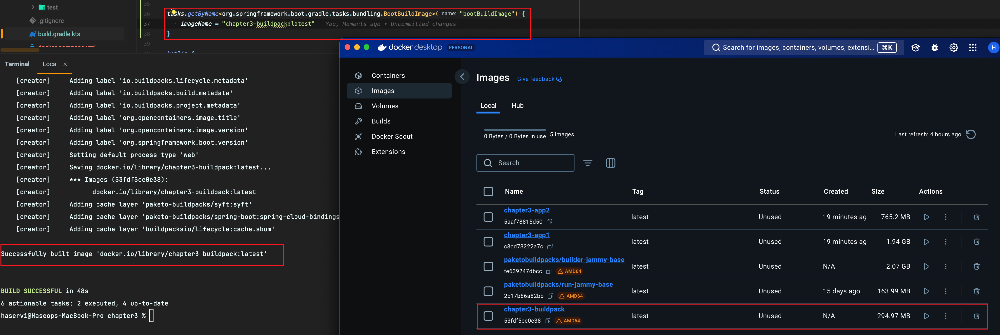
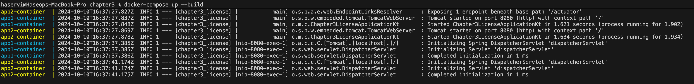

# 4장 도커

도커 컨테이너를 사용하면 소프트웨어 개발을 한 플랫폼에서 다른 플랫폼으로 빠르고 유용한 방법으로 이전하고 실행할 수 있음  
컨테이너를 마이크로서비스에 속도와 이식성, 확장성 같은 이점을 제공

## 4.1 컨테이너 또는 가상 머신?

마이크로서비스와 함께 컨테이너를 사용한다면 아래와 같은 이점을 얻을 수 있음

- 컨테이너는 어디에서나 실행할 수 있어 개발 및 구현이 용이하고 이식성을 높여줌
- 컨테이너는 다른 애플리케이션과 완전히 격리된 예측 가능한 환경을 생성해 주는 기능을 제공
- 컨테이너는 VM보다 더 빠르게 시작하고 중지할 수 있어 클라우드 네이티브가 가능
- 컨테이너는 확장 가능하고 자원 활용을 최적화하는 데 능동적으로 스케줄링 관리할 수 있음
  - 컨테이너 내부에서 실행되는 애플리케이션의 성능과 유지 보수성을 높임
- 최소 서버로 가능한 많은 애플리케이션을 실행할 수 있음

## 4.2 도커란?

- VM 등 다른 하드웨어 자원을 몰라도 물리 머신의 자원을 여러 컨테이너와 공유할 수 있음
- 컨테이너는 애플리케이션이 실행하는 데 필요한 모든 것을 제공하는 논리적 패키징 메커니즘을 의미

도커 엔진의 구성 요소

- 도커 데몬: 컨테이너의 실행과 관리 역할을 담당하는 백그라운드 서비스
- 도커 클라이언트: 명령어를 사용해 Docker 데몬과 상호작용하는 인터페이스
- 도커 이미지: 컨테이너를 실행하기 위한 불변의 템플릿
- 도커 컨테이너: 이미지의 실행 인스턴스, 애플리케이션을 독립된 환경에서 실행
- 도커 레지스트리: 이미지를 저장하고 공유하는 중앙 저장소
- 도커 네트워크: 컨테이너 간의 통신을 가능하게 하는 가상 네트워크 환경
- 도커 볼륨: 데이터를 영구적으로 저장하기 위한 메커니즘

## 4.3 Dockerfiles

Dockerfile은 도커 클라이언트가 이미지를 생성하고 준비하기 위해 호출하는 데 필요한 지시어와 명령어들이 포함된 단순한 테스트 파일

Dockerfile의 주요 명령어

- FROM: 베이스 이미지 설정
  - Docker 이미지의 기본 이미지를 지정(예: FROM ubuntu:20.04)
- RUN: 명령 실행
  - 컨테이너 내부에서 명령어를 실행하고 그 결과를 이미지에 반영(예: RUN apt-get update && apt-get install -y curl)
- CMD: 컨테이너 실행 시 기본으로 실행할 명령어 지정
  - 컨테이너가 실행될 때 실행할 기본 명령을 정의하며, CMD는 단일 명령만 설정(예: CMD ["npm", "start"])
- ENTRYPOINT: 컨테이너 실행 시 실행할 명령어 설정
  - 컨테이너가 실행될 때 항상 실행될 명령어를 정의하며, CMD와 달리 고정 명령을 설정하는 데 사용되며, 추가 인자를 전달할 수 있음(예:
      ENTRYPOINT ["java", "-jar", "-Dspring.profiles.active=prod", "/java.jar])
- COPY: 파일 복사
  - 로컬 파일을 Docker 이미지로 복사(예: COPY ./app /usr/src/app)
- WORKDIR: 작업 디렉토리 설정
  - 명령어 실행 시 기본 작업 디렉토리를 설정(예: WORKDIR /usr/src/app)
- ENV: 환경 변수 설정
  - Docker 컨테이너 내부에서 사용할 환경 변수를 정의(예: ENV APP_ENV production)
- EXPOSE: 포트 노출
  - 컨테이너가 사용하는 포트를 외부에 노출(예: EXPOSE 8080)
- VOLUME: 볼륨 마운트
  - 컨테이너 외부와 공유할 디렉토리를 정의(예: VOLUME ["/src"])

## 4.4 도커 컴포즈

도커 컴포즈는 서비스 설계와 구축이 용이한 스크립트를 작성하여 도커를 더 쉽게 사용할 수 있으며, 도커 컴포즈를 사용하면 여러 컨테이너를 하나의 서비스로 실행하거나 다른 컨테이너를 동시에 생성할 수 있습니다.

도커 컴포즈 지시어

- version: Docker Compose 파일의 버전을 정의
- services: 여러 컨테이너(서비스)를 정의하는 섹션
- image: 특정 이미지를 사용하여 컨테이너를 실행하도록 지정
- port: 시작한 도커 컨테이너가 외부에 노출할 포트 번호를 지정 8080(외부):80(내부)
- environment: 시작하는 도커 이미지에 환경 변수를 전달
- networks: 컨테이너들이 소속될 네트워크를 정의(기본 bridge)

도커 컴포즈 명령어

- docker-compose up: docker-compose.yml 파일을 기반으로 모든 서비스 빌드 및 시작
- docker-compose ps : 시스템에 배포한 모든 컨테이너 목록 출력
- docker-compose down: 실행 중인 모든 서비스를 중지하고, 관련된 네트워크 및 볼륨 삭제
- docker-compose stop: 실행 중인 모든 서비스를 중지
- docker-compose build: 중지된 서비스 시작
- docker-compose logs <service_id>: 최신 배포 로그 또는 특정 서비스 로그 출력

## 4.5 마이크로서비스와 도커 통합하기

예제를 이용하여 Docker, 스프링부트 빌드팩, docker-compose 학습합니다.

### 4.5.1 도커 이미지 만들기

기본 Dockerfile: 단일 단계로 이미지를 빌드합니다. 즉, 애플리케이션의 빌드와 실행을 하나의 Docker 이미지를 통해 처리됩니다.

장점

- 구현이 간단: 한 번에 빌드하고 실행하기 때문에 복잡한 설정이 필요하지 않음
- 쉽고 직관적: Dockerfile 작성이 간편

단점

- 이미지 크기 큼: 빌드 도구, 라이브러리, 소스코드 등 모든 것을 포함하여 최종 이미지가 커질 수 있음
- 불필요한 파일 포함: 소스 코드나 빌드 도구 등 실행에 필요 없는 파일도 최종 이미지에 포함될 수 있음

멀티스테이지 빌드 Dockerfile: 멀티스테이지 빌드는 여러 단계를 거쳐 이미지를 빌드합니다. 빌드 단계와 최종 실행 단계를 분리하여 최종 이미지에는 실행에 필요한 파일들만 포함시킵니다.

장점

- 이미지 크기 작음: 빌드에 사용된 도구(예: Gradle, 소스코드)는 최종 이미지에 포함되지 않으므로 이미지 크기를 줄일 수 있음
- 보안 향상: 불필요한 파일이나 도구가 포함되지 않아 보안 위험 감소
- 효율적: 실행에 필요한 것만 포함하므로 더 가볍고 배포가 빠름

단점

- 구현 복잡성: 여러 단계를 작성해야 하므로 Dockerfile이 조금 더 복잡해질 수 있음
- 빌드 시간이 더 길어질 수 있음: 모든 단계를 명확히 정의해야 하므로, 빌드 과정이 다소 길어질 수 있음

### 4.5.2 스프링 부트로 도커 이미지 생성하기

스프링부트 내부에서 이미지를 생성할 수 있게 합니다. 도커가 활성화 된 상태에서 스프링 부트 v2.3 이상인 경우 생성가능합니다.

빌드팩은 애플리케이션 및 프레임워크 의존성을 제공하는 도구로, 소스 코드를 실행 가능한 애플리케이션 이미지로 변환할 수 있습니다.

### 4.5.3 도커 컴포즈로 서비스 실행하기

실습 예제를 이용해 docker-compose.yml의 여러 서비스를 동시에 제어할 수 있습니다.

도커 실행 관련 명령어(컨테이너, 이미지, 볼륨, 네트워크, 시스템 관리)

- docker run 이미지이름: 컨테이너 생성 및 실행
- docker ps: 실행 중인 컨테이너 목록 보기
- docker stop 컨테이너ID: 컨테이너 중지
- docker start 컨테이너ID: 중지된 컨테이너 시작
- docker rm 컨테이너ID: 컨테이너 삭제
- docker exec 컨테이너ID: 컨테이너에서 명령 실행
- docker pull 이미지이름: 이미지 다운로드
- docker build -t 이미지이름 .: 이미지 빌드
- docker images: 이미지 목록 보기
- docker rmi 이미지ID: 이미지 삭제
- docker volume create 볼륨이름: 볼륨 생성
- docker volume ls: 볼륨 목록 보기
- docker volume rm 볼륨이름: 볼륨 삭제
- docker network create 네트워크이름: 네트워크 생성
- docker network ls: 네트워크 목록 보기
- docker network rm 네트워크이름: 네트워크 삭제
- docker logs: 컨테이너 로그 보기
- docker stats: 컨테이너 리소스 사용량 보기
- docker system prune: 불필요한 데이터 정리

도커 명령어 옵션

- -d: 백그라운드에서 컨테이너 실행. 컨테이너가 백그라운드에서 실행되며, 콘솔을 점유하지 않음(예: docker run -d myimage)
- -p: 포트 매핑. 호스트의 포트를 컨테이너 내부 포트와 연결(예: docker run -p 8080:80 myimage)
- --rm: 컨테이너 종료 시 삭제. 컨테이너가 종료되면 자동으로 삭제(예: docker run --rm myimage)
- --name: 컨테이너 이름 설정. 실행되는 컨테이너에 특정 이름을 지정(예: docker run --name mycontainer myimage)
- -v: 볼륨 마운트. 호스트의 디렉토리나 파일을 컨테이너 내부에 마운트(예: docker run -v /host/path:/container/path myimage)
- --env or -e: 환경 변수 설정. 컨테이너 실행 시 환경 변수를 설정(예: docker run -e "ENV_VAR=value" myimage)
- --network: 네트워크 설정. 컨테이너를 특정 네트워크에 연결(예: docker run --network my_network myimage)
- --entrypoint: 기본 실행 명령을 변경. 컨테이너 시작 시 기본적으로 실행되는 명령을 재정의(예: docker run --entrypoint /bin/bash myimage)
- -it: 인터랙티브 모드 및 TTY 사용. 컨테이너의 쉘로 진입하여 직접 명령을 실행(예: docker run -it myimage /bin/bash)
- --cpu: CPU 리소스 제한. 컨테이너가 사용할 수 있는 CPU 리소스를 제한(예: docker run --cpu-shares=512 myimage)
- --memory or -m: 메모리 사용량 제한. 컨테이너가 사용할 수 있는 최대 메모리 용량을 설정(예: docker run -m 512m myimage)
- --restart: 재시작 정책 설정. 컨테이너가 종료되었을 때 다시 시작할지 설정합니다.(예: docker run --restart always myimage)
