# 5장 스프링 클라우드 컨피그 서버로 구성 관리

- [5장 스프링 클라우드 컨피그 서버로 구성 관리](#5장-스프링-클라우드-컨피그-서버로-구성-관리)
  - [5.1 구성(그리고 복잡성) 관리](#51-구성그리고-복잡성-관리)
    - [5.1.1 구성 관리 아키텍처](#511-구성-관리-아키텍처)
    - [5.1.2 구현 솔루션 선택](#512-구현-솔루션-선택)
  - [5.2 스프링 클라우드 컨피그 서버 구축](#52-스프링-클라우드-컨피그-서버-구축)
    - [5.2.1 스프링 클라우드 컨피그 부트스트랩 클래스 설정](#521-스프링-클라우드-컨피그-부트스트랩-클래스-설정)
    - [5.2.2 스프링 클라우드 컨피그 서버에 파일 시스템 사용](#522-스프링-클라우드-컨피그-서버에-파일-시스템-사용)
    - [5.2.3 서비스의 구성 파일 설정](#523-서비스의-구성-파일-설정)
  - [5.3 스프링 클라우드 컨피그와 스프링 부트 클라이언트 통합](#53-스프링-클라우드-컨피그와-스프링-부트-클라이언트-통합)
    - [5.3.1 라이선싱 서비스의 스프링 클라우드 컨피그 서비스 의존성 설정](#531-라이선싱-서비스의-스프링-클라우드-컨피그-서비스-의존성-설정)
    - [5.3.2 스프링 클라우드 컨피그 사용을 위한 라이선싱 서비스 구성](#532-스프링-클라우드-컨피그-사용을-위한-라이선싱-서비스-구성)
    - [5.3.3 스프링 클라우드 컨피그 서버를 사용하여 데이터 소스 연결](#533-스프링-클라우드-컨피그-서버를-사용하여-데이터-소스-연결)
    - [5.3.4 @ConfigurationProperties를 사용하여 프로퍼티 직접 읽기](#534-configurationproperties를-사용하여-프로퍼티-직접-읽기)
    - [5.3.5 스프링 클라우드 컨피그 서버를 사용하여 프러퍼티 갱신](#535-스프링-클라우드-컨피그-서버를-사용하여-프러퍼티-갱신)
    - [5.3.6 깃과 함께 스프링 클라우드 컨피그 서버 사용](#536-깃과-함께-스프링-클라우드-컨피그-서버-사용)
    - [5.3.7 볼트와 스프링 클라우드 컨피그 서비스 통합](#537-볼트와-스프링-클라우드-컨피그-서비스-통합)
    - [5.3.8 볼트 UI](#538-볼트-ui)
  - [5.4 중요한 구성 정보 보호](#54-중요한-구성-정보-보호)
    - [5.4.1 대칭 암호화 키 설정](#541-대칭-암호화-키-설정)
    - [5.4.2 프로퍼티 암호화와 복호화](#542-프로퍼티-암호화와-복호화)

애플리케이션 구성 정보와 코드를 분리하는 것이 중요하며, 아래와 같이 구성 정보를 분리를 고려해야 합니다.

- 배포되는 실제 코드와 구성 정보를 완전히 분리
- 여러 환경에서도 절대 변경되지 않는 불변 애플리케이션 이미지를 빌드
- 서버가 시작할 때 마이크로서비스가 읽어오는 환경 변수 또는 중앙 저장소를 통해 모든 애플리케이션 구성 정보를 주입

## 5.1 구성(그리고 복잡성) 관리

클라우드 마이크로서비스를 수동으로 구성하거나 건드릴 경우 구성 불일치나 예기치 않는 장애, 확장 문제 대응을 위한 지연 시간 등이 발생할 수 있습니다.

이를 방지하기 위한 클라우드에서 마이크로서비스 구성 관리를 위한 4가지 원칙입니다.

- 분리: 서비스의 물리적 배포에서 서비스 구성 정보를 완전히 분리해야 하며, 시작 중인 서비스에 환경 변수로 전달되거나 서비스가 시작할 때 중앙 저장소에서 읽어야 함
- 추상화: 서비스 인터페이스 뒷단에 있는 구성 데이터의 접근 방식을 추상화해야 함. 서비스 저장소(파일 기반 또는 JDBC 데이터 베이스 기반)에서 직접 읽어 오는 코드를 작성하기보다 REST 기반 JSON
  서비스를 사용 해야함
- 중앙 집중화: 구성 데이터 저장소는 가능한 적은 수의 저장소로 애플리케이션 구성 정보를 모아야 함
- 견고화: 애플리케이션 구성 정보는 배포되는 서비스와 완전히 분리되고 중앙 집중화되므로 사용하고 구현할 솔루션은 가용성이 높고 이중화가 필요

애플리케이션 구성 데이터가 분리된 경우 외부 의존성이 생기므로 해당 구성 데이터는 추적 가능하고 버전을 제어할 수 있어야 함

### 5.1.1 구성 관리 아키텍처

구성 관리는 부트스트래핑 단계에서 발생합니다.

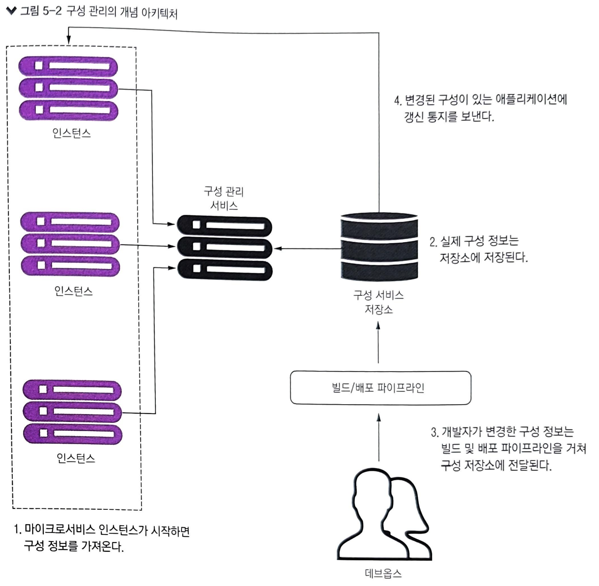

### 5.1.2 구현 솔루션 선택

구성 관리 시스템 구현을 위한 오픈 소스 프로젝트 종류

- etcd: 서비스 디스커버리와 키-값 관리에 사용
- Eureka: 서비스 디스커버리와 키-값 관리에 사용(유연하지만 공수가 듬)
- Consul: etcd와 유레카와 유사하지만 분산 컴퓨팅 모델에 다른 알고리즘을 사용
- Apache Zookeeper: 주로 키-값 데이터를 액세스하는 구성 관리 솔루션으로 사용(사용하기 복잡)
- Spring Cloud Config: 오픈 소스 프로젝트로 다양한 백엔드와 함께 전반적인 구성 관리 솔루션 제공
- 하시코프 볼트(HashiCorp Vault): 비밀 관리 및 데이터 암호화 솔루션

Spring Cloud Config 특징

- 스프링 클라우드 구성 서버는 설치와 사용이 쉬움
- 스프링 부트와 밀접하게 통합되어 있어 간단한 애너테이션을 사용하여 애플리케이션의 모든 구성 데이터를 읽어올 수 있음
- 구성 데이터를 저장하는 많은 백엔드를 지원
- 깃 소스 제어 플랫폼이나 하시코프볼트와 바로 통합 가능

## 5.2 스프링 클라우드 컨피그 서버 구축

스프링 컨피그 서버 프로젝트를 생성합니다.

[chapter5 학습 코드](https://github.com/haservi/book-spring-microservice-kotlin/tree/main/chapter5_configserver)

### 5.2.1 스프링 클라우드 컨피그 부트스트랩 클래스 설정

`@EnableConfigServer` 애너테이션을 사용하여 해당 서비스를 스프링 클라우드 컨피그 서비스로 활성화합니다.

### 5.2.2 스프링 클라우드 컨피그 서버에 파일 시스템 사용

스프링 클라우드 native: 클라우드 컨피그 서버용으로만 생성한 프로파일이며, 구성 파일을 클래스 패스나 파일 시스템에서 검색하고 읽도록 지시하는 프로파일입니다.

spring.cloud.config.server 종류

- native: 로컬 파일 시스템에서 파일 검색
- git: Git 리포지토리에서 파일 검색
- jdbc: 데이터베이스에서 파일 검색
- vault: HashiCorp Vault에서 비밀 값 검색
- consul: Consul에서 구성 값 검색
- zookeeper: Zookeeper에서 구성 값 검색

참조: [config 관련 설정 공식 문서](https://docs.spring.io/spring-cloud-config/docs/current/reference/html/)

### 5.2.3 서비스의 구성 파일 설정

스프링 Boot 2.4 이후에는 bootstarp.yml을 사용하려면 아래와 같이 DI 명시가 필요(Valut 관련은 추가 확인 필요)

ApplciationContext가 로드 될 때 bootstrap을 로드 하지 않는다고 합니다.

``` bash
<dependency>
    <groupId>org.springframework.cloud</groupId>
    <artifactId>spring-cloud-starter-bootstrap</artifactId>
</dependency>

implementation("org.springframework.cloud:spring-cloud-starter-bootstrap")
```

스프링 클라우드 에서는 bootstap.yml -> application.yml 순서로 로딩이 되며, 아래와 같이 역할에 맞게 구성 정보를 넣는게 좋습니다.

- bootstap.yml: 초기화 및 외부 구성 서버 설정(uri, 약간의 encryption/decryption 정보)
- application.yml: 애플리케이션의 일반 설정

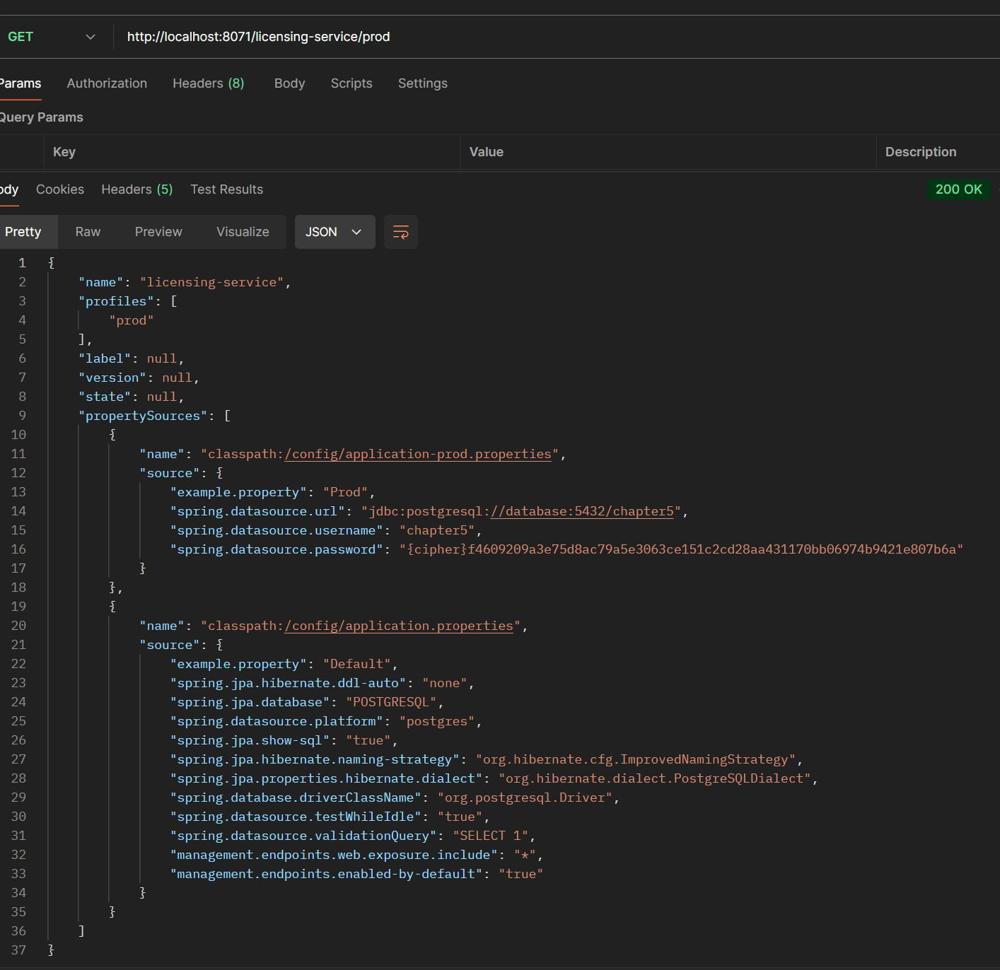

참조 링크

- [스프링 2.4 이후 deprecatted 된 이유](https://stackoverflow.com/questions/64994034/bootstrap-yml-configuration-not-processed-anymore-with-spring-cloud-2020-0)
- [스프링 부트에서 application.yml이나 bootstrap.yml 속성의 차이](https://stackoverflow.com/questions/32997352/what-is-the-difference-between-putting-a-property-on-application-yml-or-bootstra)

## 5.3 스프링 클라우드 컨피그와 스프링 부트 클라이언트 통합

라이선신 서비스 정보 검색 순서

- 라이선싱 서비스 부팅 시 스프링 프로파일에 설정된 엔드포인트로 스프링 클라우드 컨피그 서비스와 통신
- 스프링 클라우드 컨피그 서비스는 구성된 백엔드 저장소를 사용하여 URI 매개변수로 전달된 스프링 프로파일에 해당하는 구성 정보를 검색
- 적절한 프로퍼티 값이 라이선싱 서비스로 다시 전달되면 스프링 부트 프레임워크는 이 값을 애플리케이션의 적절한 부분에 주입

### 5.3.1 라이선싱 서비스의 스프링 클라우드 컨피그 서비스 의존성 설정

라이선싱 서비스를 위한 의존성 추가합니다.

- spring-cloud-starter-config: 스프링 클라우드 컨피그에 필요한 의존성 설정
- spring-boot-starter-data-jpa: jpa 의존성 설정
- postgresql: postgres 드라이버 의존성 설정

### 5.3.2 스프링 클라우드 컨피그 사용을 위한 라이선싱 서비스 구성

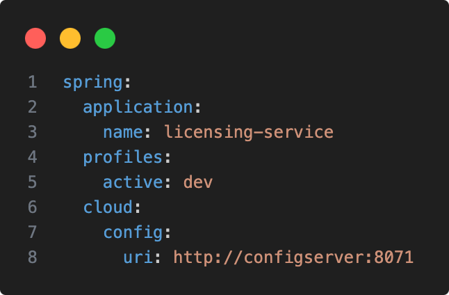

- name: 라이선싱 서비스의 이름을 지정하여 스프링 클라우드 컨피그 클라이언트는 어떤 서비스가 검색되는지 알 수 있음
- active: 서비스가 실행될 프로파일 지정
- config.uri: 스프링 클라우드 컨피그 서버의 위치 지정

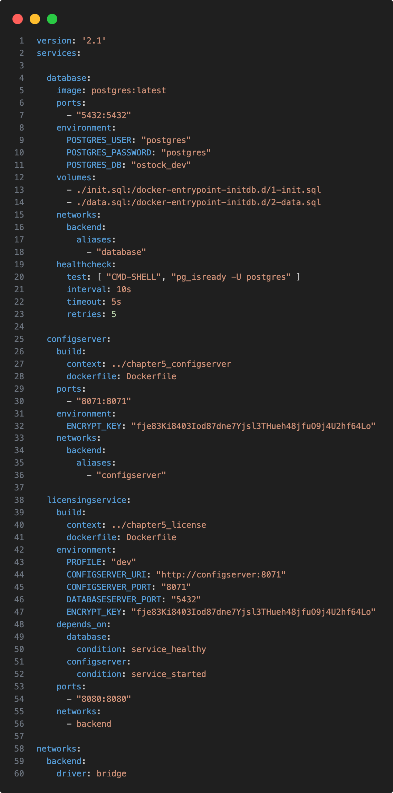

위와 같이 docker-compose.yml을 설정하여 실제로 라이선싱 서비스가 스프링 클라우드 컨피그를 통해 DB 접속 정보를 제공 받는지 확인합니다.

### 5.3.3 스프링 클라우드 컨피그 서버를 사용하여 데이터 소스 연결

docker-compose로 실행한 라이선싱 서비스가 스프링 클라우드 컨피그 서버에서 제공한 DB 정보를 제공 받아 데이터를 넣는지 실습합니다.

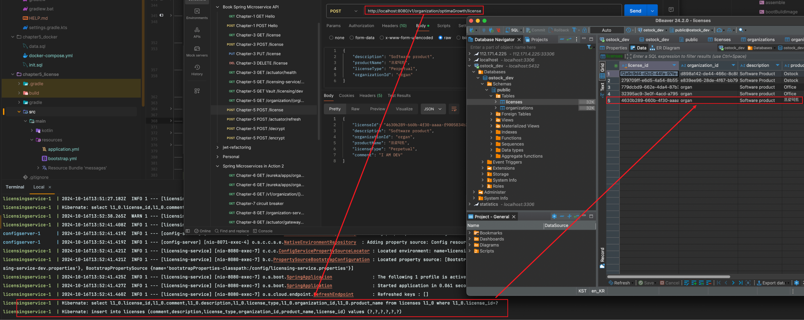

### 5.3.4 @ConfigurationProperties를 사용하여 프로퍼티 직접 읽기

라이선싱 서비스에서 bootstrap.yml 의 active에 따라 설정값이 바뀌는지 확인합니다.

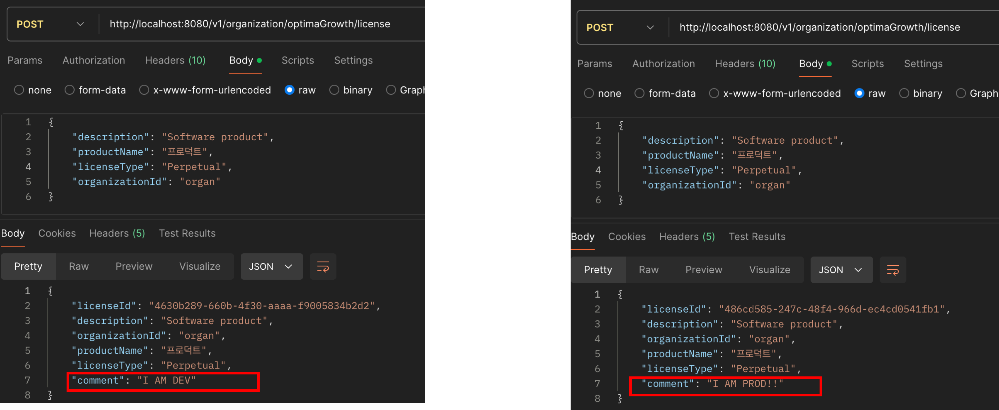

### 5.3.5 스프링 클라우드 컨피그 서버를 사용하여 프러퍼티 갱신

@RefreshScope는 Spring Cloud Config에서 사용하는 어노테이션으로, Spring Bean이 동적으로 변경 가능한 속성을 갖도록 지원하는 기능입니다.

주로 Spring Cloud Config와 Spring Actuator의 /refresh 엔드포인트와 함께 사용됩니다.

http://localhost:8080/actuator/refresh 호출 시 config 서버에서 설정값을 다시 읽어옴

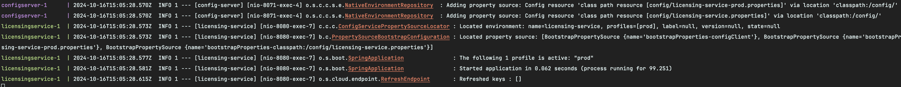

### 5.3.6 깃과 함께 스프링 클라우드 컨피그 서버 사용

스프링 클라우드 컨피그 서버는 백엔드 저장소로 사용하는 것은 클라우드 기반 애플리케이션에 실용적이지 못합니다.

- 개발팀이 컨피그 서버의 모든 인스턴스에 마운트되는 공유 파일 시스템을 설정하고 관리해야 함
- 컨피그 서버는 애플리케이션 구성 프로퍼티를 호스팅하는데 다양한 백엔드 저장소와 통합될 수 있음

깃과 함께 스프링 클라우드 컨피그 사용 시 장점

- 구성 관리할 프로퍼티를 소스 제어하에 두는 이점을 얻을 수 있음
- 프로퍼티 관리 파일의 배포를 빌드 및 배포 파이프라인에 쉽게 통합할 수 있음

### 5.3.7 볼트와 스프링 클라우드 컨피그 서비스 통합

하시코프 볼트는 시크릿에 안전하게 접근할 수 있는 도구이며 패스워드, 인증서, API 키등 접근을 제한하거나 제한하려는 어떤 정보로도 시크릿을 정의할 수 있습니다.

스프링 컨피그 서비스에서 볼트를 구성하려면 볼트 프로파일을 추가해야 하며, 볼트를 사용하면 마이크로서비스의 애플리케이션 프로퍼티를 안전하게 저장할 수 있습니다.

볼트 컨테이너 생성 방법

```bash
docker run -d -p 8200:8200 --name valut -e 'VAULT_DEV_ROOT_TOKEN_ID=myroot -e 'VAULT_DEV_LISTEN_ADDRESS=0.0.0.0:8200' valut
```

- VAULT_DEV_ROOT_TOKEN_ID: 루트 토큰 ID 설정, 루트 토큰은 볼트 구성을 시작하는 초기 엑세스 토큰
- VAULT_DEV_LISTEN_ADDRESS: 개발 서버의 IP 주소와 포트를 설정. 기본값은 0.0.0.0:8200

### 5.3.8 볼트 UI

볼트는 시크릿 생성 과정을 도와주는 통합 인터페이스를 제공합니다.

docker-compose를 통해 vault 아래와 같이 이미지를 설정합니다.

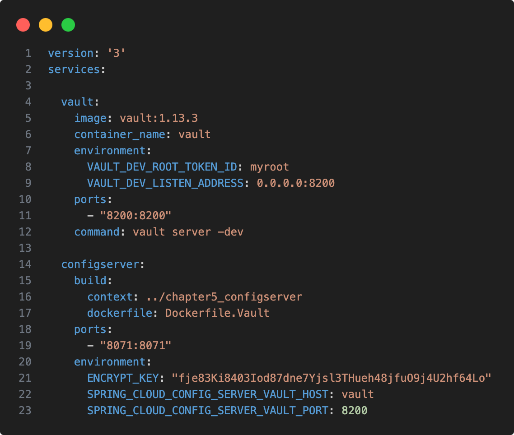

config server의 Dockerfile 정보입니다.

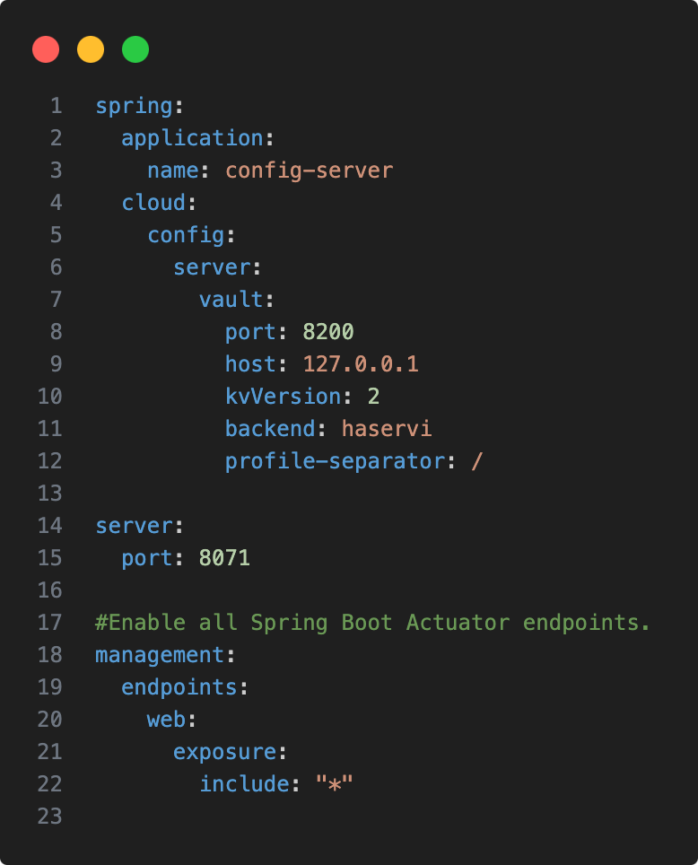

이렇게 설정 후 Volt UI에서 아래와 같이 미리 지정한 TokenId(myroot)로 로그인합니다.

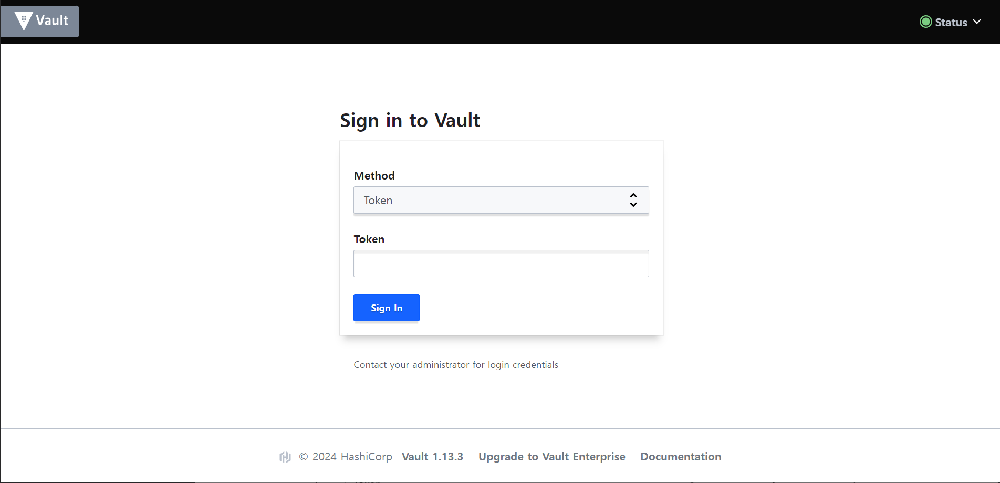

KV(Key-Value)로 시크릿 엔진을 생성합니다.
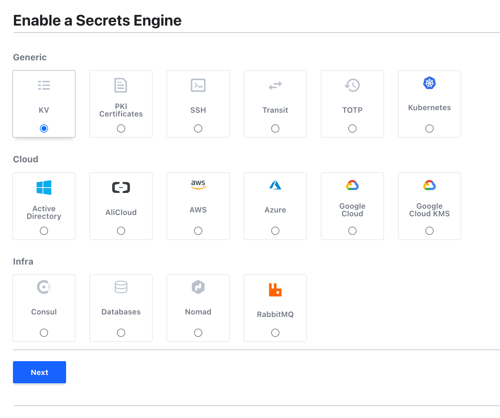
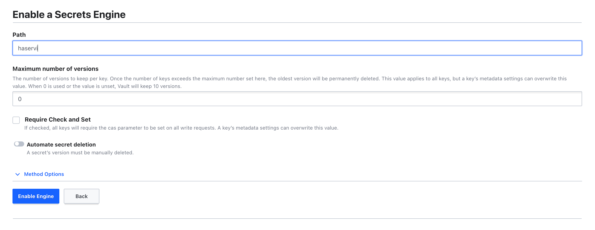

아래와 같이 시크릿을 생성하면 config-server에서 해당 시크릿을 확인할 수 있습니다.
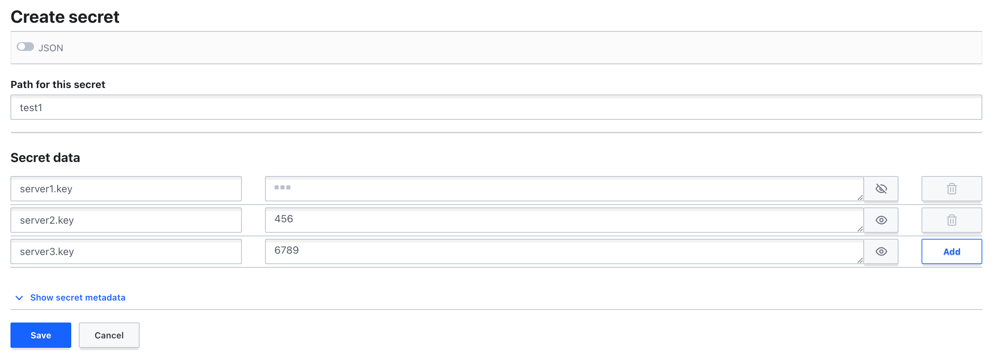
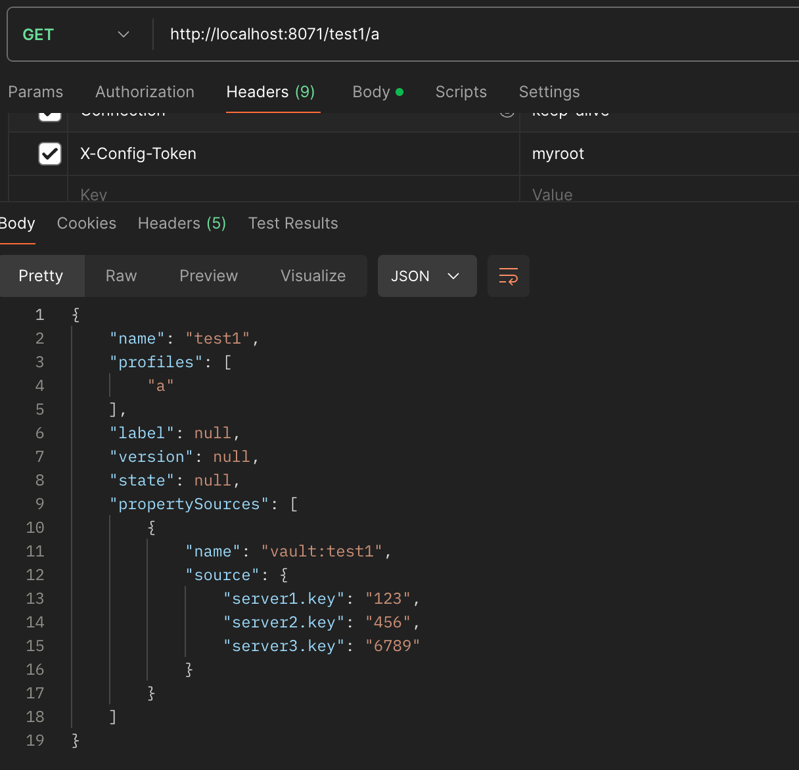

## 5.4 중요한 구성 정보 보호

프로퍼티 안의 중요한 자격 증명을 평문으로 소스 코드 저장소에 저장하는 것은 매우 나쁜 관행입니다.

스프링 클라우드 컨피그는 중요한 프로퍼티를 쉽게 암호화할 수 있는 기능을 제공하며, 대칭(공유 시크릿) 및 비대칭 암호화(공개/비공개) 키 사용을 지원합니다.

### 5.4.1 대칭 암호화 키 설정

스프링 클라우드 컨피그의 bootstrap.yml 파일에 아래와 같이 설정하거나 ENCRYPT_KEY 라는 OS 환경 변수로 프로퍼티 암호화 복호화 기능을 사용할 수 있습니다.

```yaml
# bootstrap.yml

encrypt:
  key: 대칭키(12문자 이상이며 불규칙 문자열이 이상적)

# docker-compose.yml

environment:
  ENCRYPT_KEY: "fje83Ki8403Iod87dne7Yjsl3THueh48jfuO9j4U2hf64Lo"
```

### 5.4.2 프로퍼티 암호화와 복호화

스프링 클라우드 컨피그 인스턴스를 실행하면 기존 설정한 시크릿키를 감지하고 /encrypt와 /decrypt 두 개의 엔드포인트를 사용할 수 있습니다.

아래와 같이 암호화 및 복호화가 가능합니다.

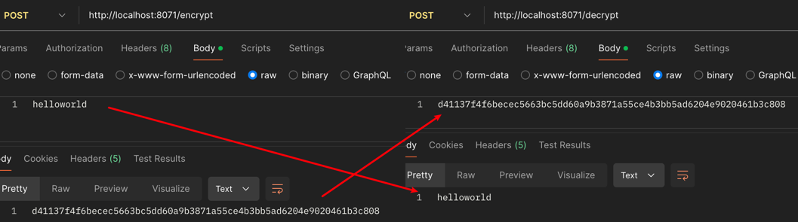

암호화된 값은 프로퍼티에 {cipher}를 붙여서 아래와 같이 처리할 수 있습니다.

```properties
spring.datasource.password={cipher}f4609209a3e75d8ac79a5e3063ce151c2cd28aa431170bb06974b9421e807b6a
```
