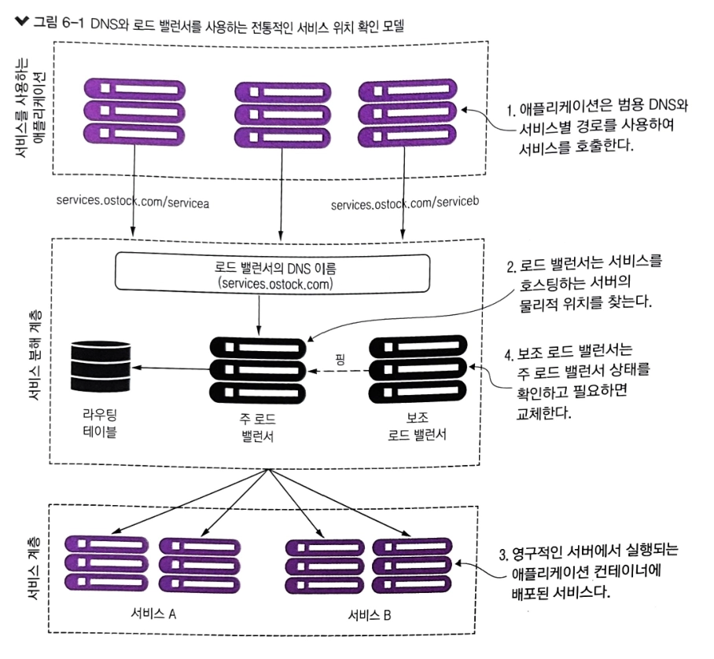
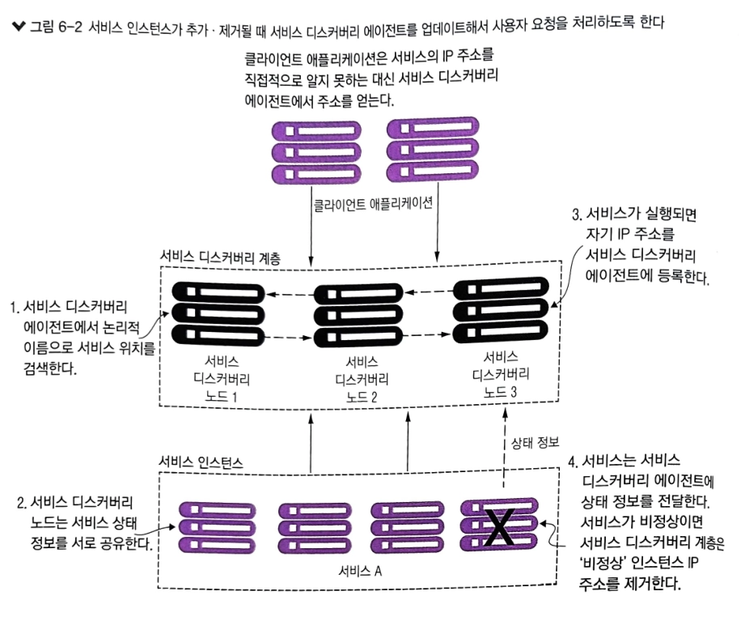
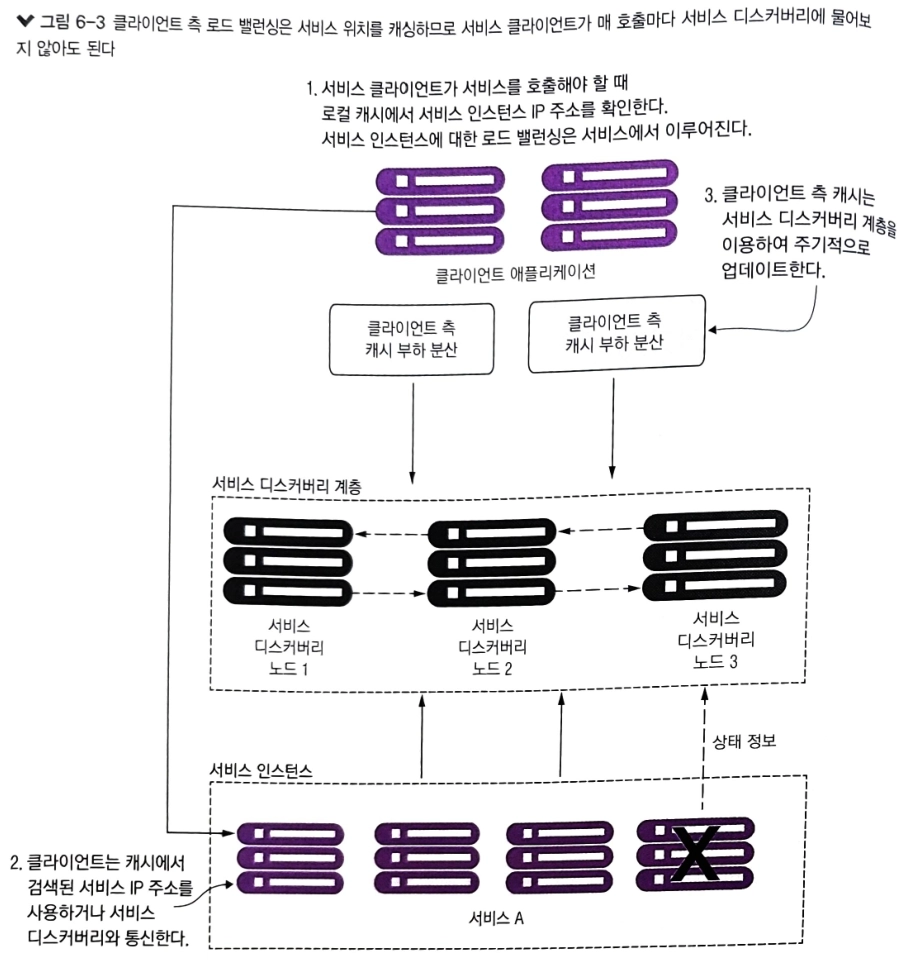
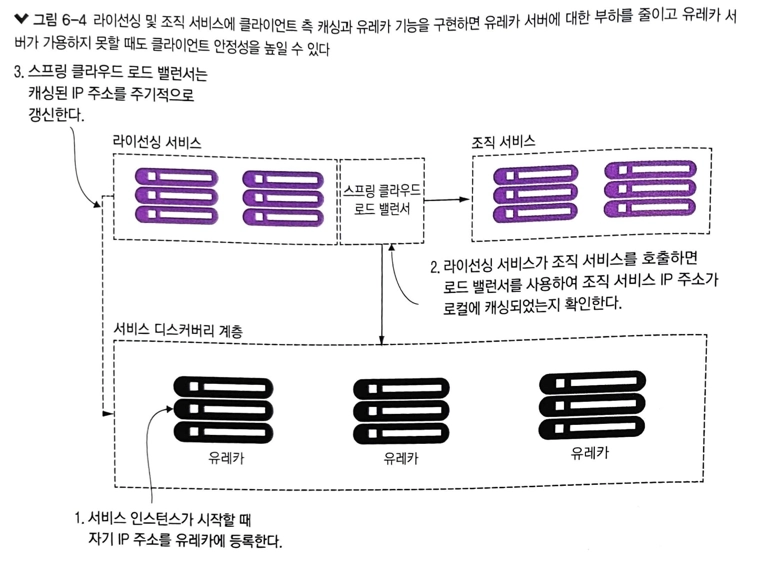
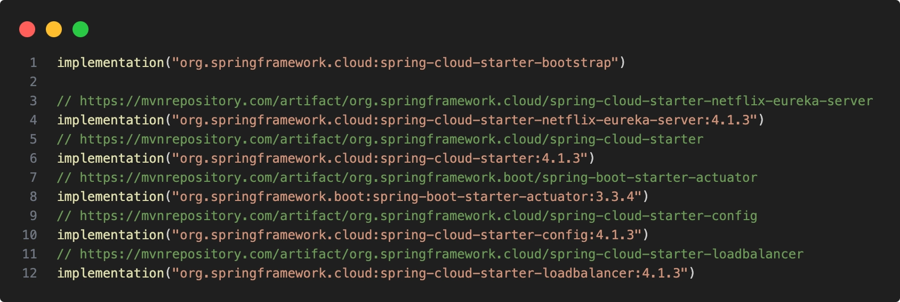
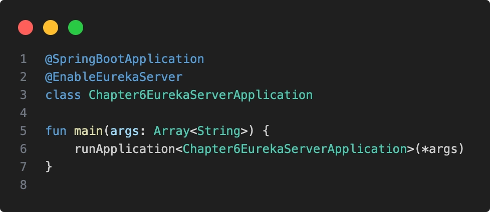
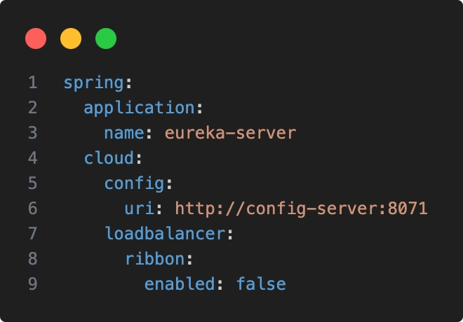
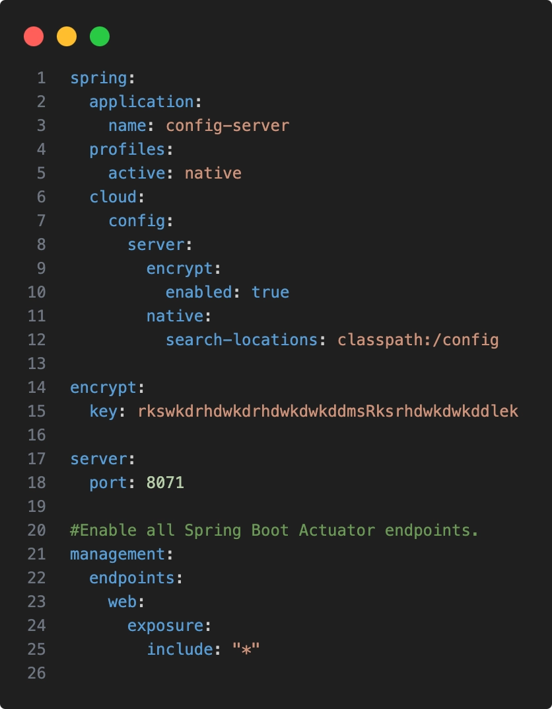
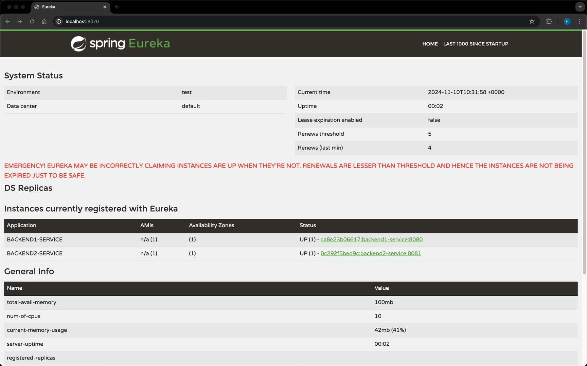

# 6장 서비스 디스커버리

- [6장 서비스 디스커버리](#6장-서비스-디스커버리)
  - [6.1 서비스 위치 확인](#61-서비스-위치-확인)
  - [6.2 클라우드에서 서비스 디스커버리](#62-클라우드에서-서비스-디스커버리)
    - [6.2.1 서비스 디스커버리 아키텍처](#621-서비스-디스커버리-아키텍처)
    - [6.2.2 스프링과 넷플릭스 유레카를 사용한 서비스 디스커버리](#622-스프링과-넷플릭스-유레카를-사용한-서비스-디스커버리)
  - [6.3 스프링 유레카 서비스 구축](#63-스프링-유레카-서비스-구축)
  - [6.4 스프링 유레카에 서비스 등록](#64-스프링-유레카에-서비스-등록)
    - [6.4.1 유레카 RSET API](#641-유레카-rset-api)

서비스 디스커버리는 다음 두 가지 핵심적인 이유로 마이크로서비스와 클라우드 기반 애플리케이션에서 중요합니다.

- 수평 확장: 애플리케이션 아키텍처에서 클라우드 서비스 내 더 많은 서비스 인스턴스 및 컨테이너를 추가하는 것과 같은 조정을 요구
- 회복성: 비즈니스에 영향을 주지 않고 아키텍처와 서비스 내부의 문제로 충격을 흡수하는 능력을 의미. 한 서비스의 문제가 전체로 확산되어 서비스 소비자에게 전파되는 것을 막아야 함

## 6.1 서비스 위치 확인

클라우드가 아닌 환경에서 서비스 위치 확인은 대개 DNS와 네트워크 로드밸런서의 조합으로 해결됐었습니다.

위의 모델은 사방이 벽으로 둘러싸인 회사 데이터 센터 안에서 실행되는 애플리케이션과 고정적인 서버에서 실행되는 비교적 적은 수의 서비스에서 잘 동작하지만 클라우드 기반의 마이크로
서비스 애플리케이션에서는 잘 동작하지 않습니다.

DNS와 로드 밸런서를 사용하는 전통적인 서비스 위치 확인 모델이 클라우드 기반의 마이크로 서비스 애플리케이션에서 잘 동작하지 않는 이유

- 고가용성 로드 밸런서를 만들 수 있더라도 전체 인프라스트럭처에서 보면 단일 장애 지점
  - 로드 밸런서가 다운되면 이것에 의존하는 모든 애플리케이션도 다운 됨
- 서비스를 하나의 로드 밸런서 클러스터에 집중시키면 여러 서버에 부하를 분산하는 인프라스트럭처의 수평 확장 능력이 제한 됨
  - 상용 로드 밸런서 다수는 이중화 모델과 라이선싱 비용이라는 두 가지 요소에 제약을 받음
  - 보조 로드 밸런서는 주 로드 밸런서가 다운된 경우 페일오버(장애 조치 기능으로 시스템 장애 이벤트 발생 시 하나 이상의 예비 백업 시스템으로 자동 전환)만을 위해 존재함
  - 상용 로드 밸런스를 좀 더 가변적인 모델이 아닌 고정된 용량에 맞추어져 제한적인 라이선싱 모델
- 전통적인 로드 밸런서 대부분은 고정적으로 관리
  - 중앙 집중식 데이터베이스를 사용하여 경로 규칙을 저장
  - 대개 공급업체의 독점적인 API를 사용해야만 새로운 경로를 저장할 수 있음
- 로드 밸런서가 프록시 역할을 하므로 서비스 소비자 요청은 물리적 서비스에 매핑되어야 함
  - 해당 변환 계층은 수동으로 서비스 매핑 규칙을 정의하고 배포해야 하므로 서비스 인프라스트럭처의 복잡성을 가중시킴
  - 전통적 로드 밸런서 시나리오에서는 새로운 서비스 인스턴스가 시작할 때 로드 밸런서에 등록되지 않음

위와 같은 이유로 대규모 트랜잭션과 이중화를 처리해야 하는 클라우드에서는 중앙 집중식 네트워크 인프라스트럭처는 효율적으로 확장되지도 않고 비용 효율도 낮아서 제대로 작동하지 않습니다.

## 6.2 클라우드에서 서비스 디스커버리

클라우드 기반 마이크로서비스 환경에서 해결책은 다음과 같은 특성을 가진 서비스 디스커버리 메커니즘을 사용하는 것입니다.

- 고가용성
  - 서비스 디스커버리는 서비스 디스커버리 클러스터의 노드 간 서비스 검색 정보가 공유되는 핫클러스터링 환경을 지원할 수 있어야 함
  - 한 노드가 가용하지 않으면 클러스터 내 다른 노드가 그 역할을 대신해야 함
  - 클러스터는 서버 인스턴스들의 그룹으로 정의할 수 있음. 이 경우 모든 인스턴스는 고가용성, 안정성, 확장성을 제공하고자 동일한 구성을 갖고 협업함
  - 로드 밸런서와 통합된 클러스터는 서비스 중단을 방지하는 페일오버와 세션 데이터를 저장하는 세션 복제 기능을 제공할 수 있음
- P2P
  - 서비스 디스커버리 클러스터의 모든 노드는 서비스 인스턴스의 상태를 상호 공유
- 부하 분산
  - 서비스 디스커버리는 요청을 동적으로 분산시켜 관리하고 있는 모든 서비스 인스턴스에 분배해야 함
  - 서비스 디스커버리는 많은 초창기 웹 애플리케이션 구현에 사용되었던, 더 고정적이며 수동으로 관리되는 로드 밸런서를 대체함
- 회복성
  - 서비스 디스커버리 클라이언트는 서비스 정보를 로컬에 캐싱해야 함
  - 로컬 캐싱은 서비스 디스커버리 기능이 점진적으로 저하되는 것을 고려했기 때문에 서비스 디스커버리 서비스가 가용하지 않아도 애플리케이션은 여전히 작동할 수 있고,
    로컬 캐시에 저장된 정보를 기반으로 서비스를 찾을 수 있음
- 결함 내성
  - 서비스 디스커버리가 비정상 서비스 인스턴스를 탐지하면 클라이언트 요청을 처리하는 가용 서비스 목록에서 해당 인스턴스를 제거해야 함
  - 서비스를 이용하여 이러한 결함을 탐지하고 사람의 개입 없이 조치되어야 함

### 6.2.1 서비스 디스커버리 아키텍처

서비스 디스커버리를 논의하기 위해서는 4가지 개념을 이해해야합니다.
서비스 디스커버리의 주요 목표는 서비스의 물리적 위치를 수동으로 구성할 필요 없이 위치를 알려 줄 수 있는 아키텍처를 구축하는 것입니다.

- 서비스 등록: 서비스가 디스커버리 에이전트에 등록하는 방법
- 클라이언트의 서비스 주소 검색: 서비스 클라이언트가 서비스 정보를 검색하는 방법
- 정보 공유: 노드 간 서비스 정보를 공유하는 방법
- 상태 모니터링: 서비스가 서비스 디스커버리에 상태를 전달하는 방법

위는 일반적인 서비스 디스커버리 에이전트 방법입니다.

- 서비스 인스턴스는 시작할 때 서비스 검색 인스턴스가 자신을 액세스하는 데 사용할 물리적 위치, 경로, 포트를 등록
- 서비스의 각 인스턴스에는 고유 IP 주소와 포트가 있지만 동일한 서비스 ID로 등록
  - 서비스 ID는 동일한 서비스 인스턴스 그룹을 고유하게 식별하는 키일 뿐임
- 서비스는 일반적으로 하나의 서비스 디스커버리 인스턴스에만 등록
  - 서비스 디스커버리 구현체는 서비스 인스턴스 관련 데이터를 클러스터 내 다른 노드에 전달하는 데이터 전파 방법으로 P2P 모델을 사용
  - 전파 메커니즘은 서비스 구현체에 따라 하드코딩, gosiip 멀티 프로토콜, 전염신 프로토콜을 사용하여 클러스터에서 발생한 변경을 다른 노드가 발견할 수 있게 함
- 각 서비스 인스턴스는 자기 상태를 서비스 디스커버리 서비스에 푸시하거나 가져옴(pull)
  - 정상 상태를 전달하지 못한 서비스는 가용 서비스 인스턴스 풀에서 제거

위의 방법을 이용할 경우 디스커버리에 의존하여 아래와 같은 취약성이 나타납니다.

- 클라이언트가 오로지 서비스 디스커버리 엔진에만 완전히 의존하여 서비스를 호출할 때마다 서비스 위치를 확인
- 서비스 디스커버리 엔진은 등록된 마이크로서비스 인스턴스를 호출할 때마다 호출
- 서비스 클라이언트가 서비스를 찾고 호출하는 데 서비스 디스커버리 엔진에 완전히 의존하기 때문에 취약한 방법임

위와 같은 방법은 더욱 견고한 접근 방법으로 클라이언트 측 로드 밸런싱 방법입니다.

- 존별 또는 라운드 로빈 같은 알고리즘을 사용하여 클라이언트 요청을 차례로 각 서버에 전달하는 것
- 유레카와 함께 클라이언트 측 로드 밸런싱을 사용하는 장점은 서비스 인스턴스가 다운되면, 인스턴스가 레지스트리에서 제거된다는 것

위 모델에서 서비스를 소비하는 클라이언트는 서비스를 호출해야 할 때 다음 작업을 합니다.

- 서비스 소비자가 요청하는 모든 인스턴스를 위해 디스커버리 서비스와 소통한 후 데이터를 서비스 소비자의 머신 로컬에 저장
- 클라이언트가 서비스를 호출 할 때마다 서비스 소비자는 캐시에서 서비스 위치 정보를 검색
  - 클라이언트 측 캐싱은 서비스 호출이 여러 서비스 인스턴스에 분배되도록 라운드 로빈 부하 분산 알고리즘을 사용
- 클라이언트는 주기적으로 서비스 디스커버리 서비스와 소통해서 서비스 인스턴스에 대한 캐시를 갱신
  - 클라이언트 캐시는 궁극적으로 일관적이지만 클라이언트가 서비스 디스커버리 인스턴스에 접속할 때 비정상 서비스 인스턴스를 호출할 위험은 항상 존재함

### 6.2.2 스프링과 넷플릭스 유레카를 사용한 서비스 디스커버리

서비스 디스커버리 에이전트를 설정하여 서비스 디스커버리를 구현한 후 두 서비스를 에이전에 등록합니다.

조직 서비스의 두 인스턴스를 서비스 디스커버리 레지스트리에 등록한 후 클라이언트 측 로드 밸런싱을 사용하여 각 서비스 인스턴스에서 레지스트리를 검색하고 캐시할 수 있습니다.

- 서비스 부트스트래핑 시점에 라이선싱 및 조직 서비스는 유레카 서비스에 등록
  - 이 과정에서 시작하는 서비스의 서비스 ID와 해당 서비스 인스턴스의 물리적 위치 및 포트 번호를 유레카에 알려줌
- 라이선싱 서비스가 조직 서비스를 호출할 때 스프링 클라우드 로드 밸런서를 사용하여 클라이언트 측 로드 밸런싱을 제공
  - 로드 밸런서는 유레카 서비스에 접속하여 서비스 위치 정보를 검색하고 로컬에 캐시함
- 스프링 클라우드 로드 밸런서는 유레카 서비스를 주기적으로 핑해서 로컬 캐시의 서비스 위치를 갱신함

## 6.3 스프링 유레카 서비스 구축

스프링 유레카 서비스 구축합니다.

- 스프링 컨피그 서버에서 유레카 설정
- 유레카 어플리케이션 구성이 설정된 스프링 컨피그 서비스를 먼저 실행해야 함

## 6.4 스프링 유레카에 서비스 등록

유레카 서버를 동작시킨 후 아래와 같이 backend service 2개를 연결한 모습입니다.

### 6.4.1 유레카 RSET API

REST API로 서비스의 모든 인스턴스를 보려면 아래와 같이 GET 엔드포인트를 호출하면 확인할 수 있습니다.

http://localhost:8070/eureka/apps/backend1-service

유레카에서 반환되는 기본 데이터 형식은 XML이며, JSON 페이로드로 반환받으려면 Accept HTTP 헤더를 application/json으로 설정해야 합니다.
