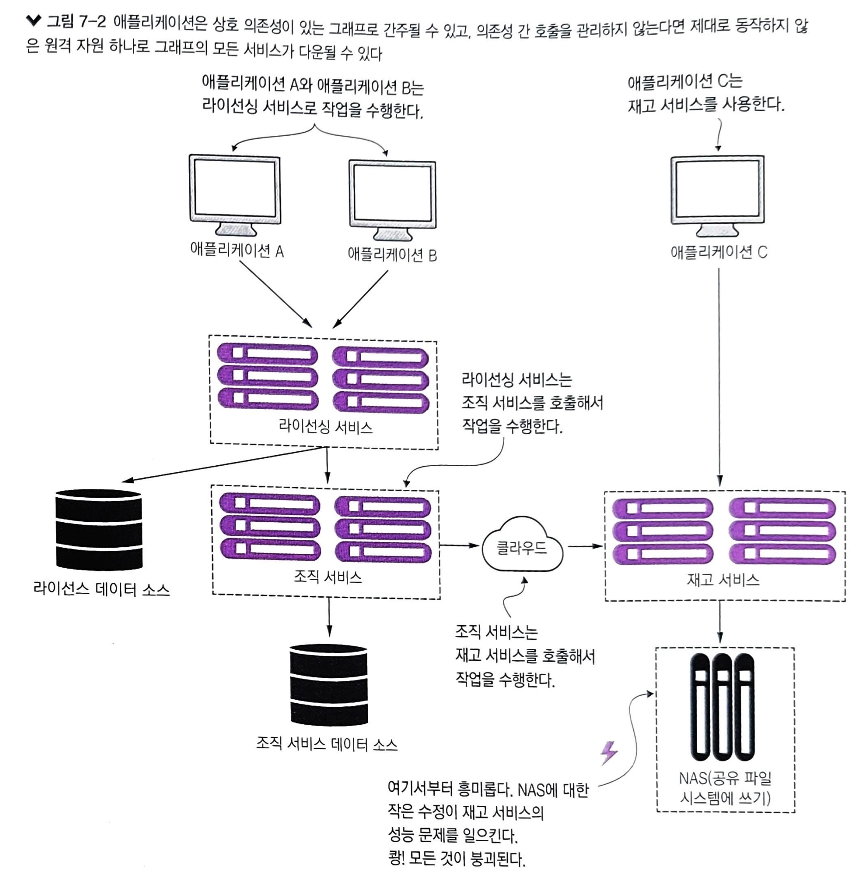
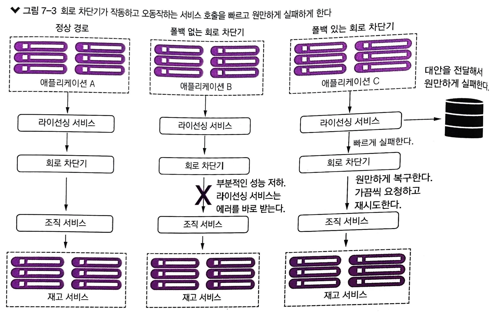
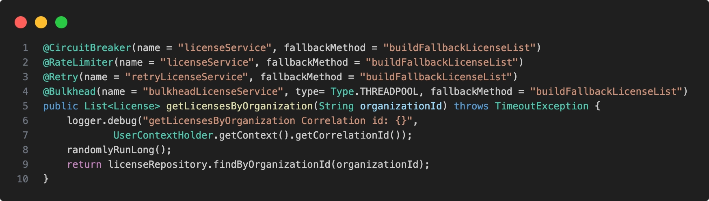
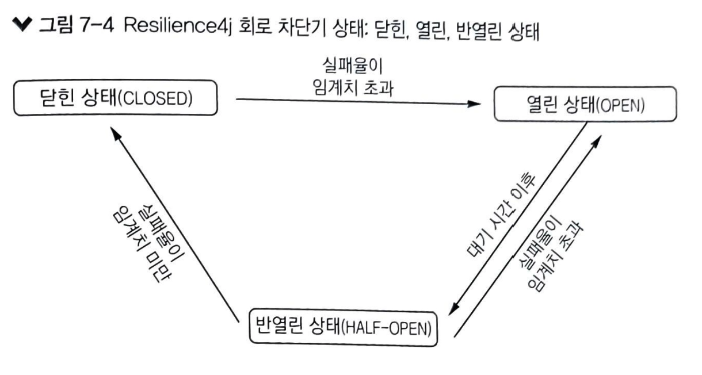
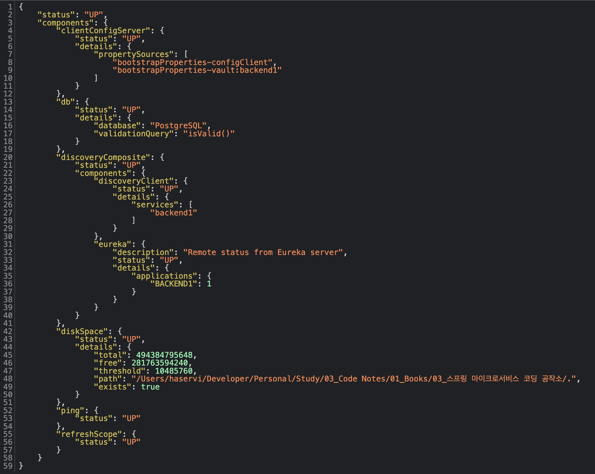
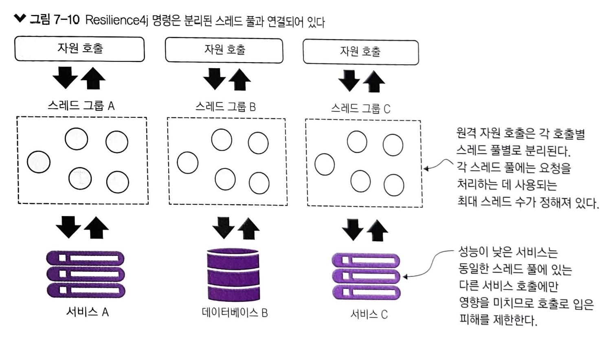

# 7장 나쁜 상황에 대비한 스프링 클라우드와 Resilience4j를 사용한 회복성 패턴

회복성을 갖춘 시스템을 구축할 때 소프트웨어 엔지니어 대부분은 인프라스트럭처나 중요 서비스의 한 부분이 완전히 실패한 경우만 고려합니다.
그들은 핵심 서버의 클러스터링, 서비스의 로드 밸런싱, 인프라스트럭처를 여러 곳에 분리하는 것 등의 기술을 사용하여 애플리케이션 각 계층에 중복성을 만드는데 집중합니다.

위와 같은 접근 방식은 서비스가 망가지면 쉽게 감지할 수 있고 애플리케이션은 이를 우회할 수 있습니다.
하지만, 서비스가 느려진다면 성능 저하를 감지하고 우회하는 일은 다음과 같은 이유로 매우 어렵습니다.

- 서비스 성능 저하는 간헐적으로 시작되어 확살될 수 있음
- 원격 서비스 호출은 대개 동기식이며 장기간 수행되는 호출을 중단하지 않음
- 대개 원격 자원의 부분적인 저하가 아닌 완전한 실패를 처리하도록 애플리케이션을 설계함
  - 서비스가 완전히 실패하지 않는 한 애플리케이션은 계속해서 불량한 서비스를 호출하고 빠르게 실패하지 못하는 경우가 많음

회복성 패턴은 마이크로서비스 아키텍처에서 가장 중요한 요소 중 하나입니다.

## 7.1 클라이언트 측 회복성이란?

클라이언트 측 회복성 소프트웨어 패턴들은 에러나 성능 저하로 원격 자원이 실패할 때 원격 자원의 클라이언트가 고장 나지 않게 보호나는 데 중점을 둡니다.

패턴은 클라리언트 측 로드 밸런싱, 회로 차단기, 폴백, 벌크헤드 네 가지 클라이언트 회복성 패턴이 있습니다.
이러한 패턴은 클라리언트가 빨리 실패하고 데이터베이스 커넥션과 스레드 풀 같은 자원을 소비하는 것을 방지할 수 있습니다.

### 7.1.1 클라이언트 측 로드 밸런싱

서비스 소비자가 서비스 인스턴스를 호출해야 할 때 클라이언트 측 로드 밸런싱은 관리 중인 서비스 위치 풀에서 위치를 반환합니다. 클라이언트 측 로드 밸런서는 서비스 클라이언트와 서비스 소비자 사이에 위치하기 때문에 서비스 인스턴스가 에러를 발생하거나 정상적으로 동작하지 않는지 탐지할 수 있습니다.

클라이언트 측 로드 밸런서가 문제를 탐지하면 가용 서비스 풀에서 문제된 서비스 인스턴스를 제거하여 해당 서비스 인스턴스로 더 이상 호출되지 않게 합니다. 해당 기능은 스프링 클라우드 로드 밸런서 라이브러리가 추가 구성 없이 제공하는 제품 기본 기능입니다.

### 7.1.2 회로 차단기

회로 차단기 패턴은 원격 서비스가 호출될 때 호출을 모니터링 합니다. 호출이 너무 오래 걸리면 차단기가 개입해서 호출을 종료합니다. 회로 차단기 패턴은 원격 자원에 대한 모든 호출을 모니터링하고, 호출이 충분히 실패하면 회로 차단기 구현체가 열리면서 빠르게 실패하고 고장 난 원격 자원에 대한 추가 호출을 방지합니다.

### 7.1.3 폴백 처리

폴백 패턴은 원격 서비스 호출이 실패할 떄 예외를 생성하지 않고 서비스 소비자가 대체 코드 경로를 실행하여 다른 수단을 통해 작업을 수행할 수 있습니다. 보통 다른 데이터 소스에서 데이터를 찾거나 향후 처리를 위해 사용자 요청을 큐에 입력하는 작업이 포함됩니다. 사용자 호출에 문제가 있다고 예외를 표시하지는 않지만 나중에 요청을 시도해야 한다고 알려 줄 수도 있습니다.

### 7.1.4 벌크헤드

벌크헤드 패턴을 사용할 때 원격 자원에 대한 호출을 자원별 스레드 풀로 분리하면, 느린 원격 자원 호출 하나로 발생한 문제가 전체 애플리케이션을 다운시킬 위험을 줄일 수 있습니다. 스레드 풀은 서비스의 벌크헤드(격벽) 역할을 합니다.
각 원격 자원을 분리하여 스레드 풀에 각각 할당합니다. 한 서비스가 느리게 응답한다면 해당 서비스의 호출 그룹에 대한 스레드 풀만 포화되어 요청 처리를 중단하게 될 수 있습니다.
스레드 풀별로 서비스를 할당하면 다른 서비스는 포화되지 않기 때문에 이러한 병목 현상을 우회하는 데 유용합니다.

## 7.2 클라이언트 회복성이 중요한 이유

클라이언트 회복성이 중요한 이유를 예제를 통해 알아볼 수 있습니다.



위는 재고 서비스의 NAS 수정으로 생긴 사이드 이슈로 성능 문제를 일으키게 됩니다.
라이선싱 서비스는 조직 서비스를 호출해서 작업을 수행합니다. 조직 서비스는 재고 서비스를 호출해서 작업을 수행하지만 재고 서비스의 이슈로 해당 영역이 제대로 동작하지 않는 문제가 발생할 수 있습니다.
그렇게 돼서 모든 서비스가 느려지게 됩니다.

위와 같은 문제를 방지하기 위해 빠르게 회복하는 시나리오는 아래와 같습니다.



위의 경우는 라이선싱 서비스는 조직 서비스를 직접 호출하지 않습니다. 그 대신 중간에 회로 차단기에 서비스에 대한 실제 호출을 위임하게 합니다.

- 첫 번째 시나리오
  - 회로 차단기는 타이머를 설정하고, 타이머가 만료되기 전에 원격 호출이 완료되면 라이선싱 서비스는 정상적으로 작업을 수행
- 두 번째 시나리오
  - 조직 서비스가 느리게 실행되어 회로 차단기가 관리하는 스레드 타이머가 만료되기 전에 호출이 완료되지 않으면, 회로 차단기는 원격 서비스에 대한 연결을 종료하고 라이선싱 서비스는 호출 오류를 반환
  - 조직 서비스에 대한 호출 시간이 만료되면 회로 차단기는 발생한 실패 횟수를 추적하기 시작하며, 특정 시간 동안 서비스에서 오류가 필요 이상으로 발생하면 회로 차단기는 회로를 차단하고 조직 서비스에 대한 모든 호출은 조직 서비스 호출 없이 실패
- 세 번째 시나리오
  - 회로 차단기의 타임아웃을 기다릴 필요 없이 문제가 있다는 것을 즉시 알 수 있음
  - 완전히 실패하거나 대체 코드(폴백)를 사용하여 조치하는 것중에서 선택할 수 있음

회로 차단기 패턴이 제공하는 주요 이점

- 빠른 실패
  - 원격 서비스가 성능 저하를 겪으면 애플리케이션은 빠르게 실패하고 전체 애플리케이션을 완전히 다운시킬 수 있는 자원 고갈 이슈를 방지
  - 대부분의 장애 상황에서 완전히 다운되는 것보다 일부가 다운되는 것이 더 나음
- 원만한 실패
  - 타임아웃과 빠른 실패를 사용하는 회로 차단기 패턴은 원만하게 실패하거나 사용자 의도를 충족하느 ㄴ대체 메커니즘을 제공할 수 있음
  - 예를 들어 사용자는 한 가지 데이터 소스에서 데이터를 검색하려고 하고, 해당 데이터 소스가 서비스 저하를 겪고 있다면 다른 위치에서 해당 데이터를 검색할 수 있음
- 원활한 회복
  - 회로 차단기 패턴이 중개자 역할을 하므로 회로 차단기는 요청 중인 자원이 다시 온라인 상태가 되었는지 확인할 수 있음
  - 사람의 개입 없이 자원에 대한 재접근을 허용하도록 주기적으로 확인

수백 개의 서비스를 가진 대규모 클라우드 기반 애플리케이션에서 이렇게 원활하게 회복하는 것은 서비스를 복구하는 데 필요한 시간을 크게 줄일 수 있어 매우 중요합니다.

## 7.3 Resilience4j 구현

Resilience4j는 히스트릭스(자바 라이브러리 중 하나)에서 영감을 받은 내결함성 라이브러입니다. 네트워크 문제나 여러 서비스의 고장으로 발생하는 결함 내성을 높이기 위해 다음 패턴을 제공합니다.

- 회로차단기: 요청받은 서비스가 실패할 때 요청을 중단
- 재시도: 서비스가 일시적으로 실패할 때 재시도
- 벌크헤드: 과부하를 피하고자 동시 호출하는 서비스 요청 수를 제한
- 속도 제한: 서비스가 한 번에 수신하는 호출 수를 제한
- 폴백: 실패하는 요청에 대해 대체 경로를 설정

Resilience4j를 사용하면 메서드에 여러 애너테이션을 정의하여 동일한 메서드 호출에 여러 패턴을 적용할 수 있습니다.



위와 같이 어노테이션을 적용할 수 있습니다.

Retry(CircuitBreaker(RateLimiter(TimeLimiter(Bulkhead(Function)))))
함수를 호출할 때는 벌크헤드 -> 시간 제한 -> 속도 제한 -> 회로차단기 -> 재시도의 순서를 기억해야 합니다. 각 패턴을 개별적으로도 사용할 수 있습니다.

회로 차단기, 재시도, 속도 제한, 폴백, 벌크헤드 패턴을 구현하려면 스레드와 스레드 관리에 대한 해박한 지식이 필요합니다.
스프링 부트와 Resilience4j 라이브러리를 사용하면 여러 마이크로서비스 아키텍처에서 항상 사용되는 검증된 도구를 제공할 수 있습니다.

## 7.4 스프링 클라우드와 Resilience4j를 사용하는 라이선싱 서비스 설정

implementation("io.github.resilience4j:resilience4j-retry:2.2.0")
implementation("io.github.resilience4j:resilience4j-ratelimiter:2.2.0")
implementation("io.github.resilience4j:resilience4j-circuitbreaker:2.2.0")
implementation("io.github.resilience4j:resilience4j-spring-boot2:2.2.0")
implementation("io.github.resilience4j:resilience4j-timelimiter:2.2.0")
implementation("io.github.resilience4j:resilience4j-ratelimiter:2.2.0")
// https://mvnrepository.com/artifact/org.springframework/spring-aop
implementation("org.springframework:spring-aop:6.1.12")

위와 같은 라이브러리를 내려받아서 이용할 수 있습니다. Resilience4j는 AOP를 활용하여 특정 함수에 기능을 추가할 수 있습니다.

관점 지향 프로그래밍(aspect-oriented programming)은 시스템의 다른 부분에 영향을 주는 프로그램 부분(횡단 관심사(cross-cutting concerns))을 분리하여 모듈성을 높이려는 프로그래밍 패러다임입니다.

## 7.5 회로 차단기 구현

회로 차단기 패턴이 추구하는 것은 원격 호출을 모니터링하고 서비스를 장기간 기다리지 않게 하는 것입니다.  
회로 차단기는 연결을 종료하고 더 많이 실패하며 오작동이 많은 호출이 있는지 모니터링하는 역할을 합니다.



회로 차단기에는 세 개의 일반 상태를 가진 유한 상태 기계가 구현되어 있습니다.

회로 차단기 패턴 순서

- Resilience4j 회로 차단기는 닫힌 상태에서 시작한 후 클라이언트 요청을 기다림
  - 닫힌 상태는 링 비트 버퍼를 사용하여 요청의 성과 및 실패 상태를 저장
- 요청이 성공하면 회로 차단기는 링 비트 버퍼에 0비트 저장, 응답 받지 못하면 1비트 저장
- 링이 모두 차면 실패율을 계산
  - 결과가 12개인 경우 12개의 요청 결과를 받아야 회로차단기가 열릴지 닫힐지 판단
- 회로가 열린 상태라면 설정된 시간 동안 호출 모두 거부
  - CallNotPermittedException 이라는 예외 발생
- 설정된 시간이 만료되면 회로 차단기는 반열린 상태로 변경
  - 서비스가 여전히 사용 불가한지 확인하고자 일부 요청을 허용
  - 설정 가능한 다른 링 비트 버퍼를 사용하여 실패율을 평가
  - 실패율이 설정된 임계치보다 높으면 회로 차단기는 다시 열린 상태로 변경
  - 만약 작다면 닫힌 상태로 변경

열린 상태에서는 회로 차단기가 모든 요청을 거부하고 닫힌 상태에서는 수락한다는 점을 기억하면 됩니다.

### 7.5.1 조직 서비스에 회로 차단기 추가

회로 차단기로 조직 서비스에 대한 호출을 래핑하고 싶다면, 간단하게 RestTemplate 호출 부분을 메서드로 분리하고 @CircuitBreaker 어노테이션을 함수에 선언하면 됩니다.

회로 차단기의 기본값은 URL을 이용하여 http://localhost:<servicer_port>/actuator/health 로 확인할 수 있습니다.



### 7.5.2 회로 차단기 사용자 정의

``` yaml
resilience4j:
  circuitbreaker:
    instances:
      backendService: -- 서비스 이름
        failureRateThreshold: 50
        slowCallRateThreshold: 50
        slowCallDurationThreshold: 2s
        permittedNumberOfCallsInHalfOpenState: 3
        slidingWindowSize: 10
        minimumNumberOfCalls: 5
        waitDurationInOpenState: 10s
        automaticTransitionFromOpenToHalfOpenEnabled: true
```

위와 같은 설정을 통하여 회로 차단기 패턴을 사용자 정의할 수 있습니다.

## 7.6 폴백 처리

회로 차단기 패턴의 장점 주 하나는 이 패턴이 중개자로 원격 자원과 그 소비자 사이에 위치하기 때문에 서비스 실패를 가로채서 다른 대안을 취할 수 있습니다.

폴백 전략에서 라이선싱 서비스는 현재 사용 가능한 라이선싱 정보가 없음을 나타내는 라이선싱 객체를 반환합니다.
@CircuitBreaker 어노테이션에 특정 함수 속성(fallbackMethod)를 추가(동일한 클래스, 동일한 매개변수)해야 합니다.

폴백 메서드가 다른 데이터 소스에서 데이터를 읽어 오는 것도 가능하며, 원하는 더미 정보를 반환할 수 있습니다.

## 7.7. 벌크헤드 패턴 구현

벌크헤드 패턴은 원격 자원 호출을 자체 스레드 풀에 격리해서 한 서비스의 오작동을 억제하고 컨테이너를 멈추지 않게 할 수 있습니다.

Resilience4j는 벌크헤드 패턴을 위해 두 가지 다른 구현을 제공합니다.

- 세마포어 벌크헤드: 세마포터 격리 방식으로 서비스에 대한 동시 요청수를 제한하며, 한계에 도달하면 요청을 거부
- 스레드 풀 벌크헤더: 제한된 큐와 고정 스레드 풀을 사용. 이 방식은 풀과 큐가 다 찬 경우만 요청을 거부

기본적으로 Resilience4j의 벌크헤드 타입은 세마포어 방식입니다.



벌크헤드 패턴도 boostrap.yml 을 이용하여 쉽게 설정할 수 있습니다.

``` yaml
resilience4j.bulkhead:
  instances:
    bulkheadLicenseService:
      maxWaitDuration: 2ms # 스레드를 차단할 최대 시간(기본값은 0)
      maxConcurrentCalls: 20 # 최대 동시 호출 수(기본값은 25)

resilience4j.thread-pool-bulkhead:
  instances:
    bulkheadLicenseService:
      maxThreadPoolSize: 1 # 스레드 풀에서 최대 스레드 수
      coreThreadPoolSize: 1 # 코어 스레드 풀 크기
      queueCapacity: 1 # 큐 용량
      keepAliveDuration: 20ms # 유휴 스레드가 종료되기 전 새 태스트를 기다리는 최대 시간
                              # (스레드 수가 코어 스레드 수보다 많을 때 발생함 기본값 20ms)
```

사용자에게 맞는 스레드 풀의 적절한 크기를 구하는 공식은 아래와 같습니다.

(서비스가 정상일 때 최고점(peak)에서 초당 요청 수 * (99 백분위수 지연 시간(단위:초))) + 부하를 대비해서 약간의 추가 스레드(80프로정도로 생각)
초당 10개의 스레드 처리 * 요청당 평균 2초 소요 * (80프로 정도)
10 * 2 * 0.8 = 16 스레드

## 7.8 재시도 패턴 구현

재시도 패턴은 서비스가 처음 실패했을 때 서비스와 통신을 재시도하는 역할을 합니다.
해당 패턴의 경우 해당 서비스 인스턴스에 대한 재시도 횟수와 재시도 사이에 전달하려는 간격을 지정해야 합니다.

bootstrap.yml을 이용하여 재시도 패턴도 사용자가 설정할 수 있습니다.

``` yaml
resilience4j.retry:
  instances:
    retryLicenseService: # 적용할 서비스 이름
      maxRetryAttempts: 5 # 재시도 최대 횟수
      waitDuration: 10000 # 재시도 간 대기 시간
      retry-exceptions: # 재시도 대상 예외
        - java.util.concurrent.TimeoutException

- intervalFunction: # 실패 후 대기 시간 간격을 수정하는 함수를 설정
- retryOnResultPredicate: # 결과에 따라 재시도 여부를 판별하도록 설정. 재시도하려면 true를 반환 해야함
- retryOnExceptionPredicate: # 예외에 따라 재시도 여부를 판별하도록 설정. 재시도하려면 true를 반환 해야함
- ignoreException: #무시해서 재시도하지 않는 에러 클래스 리스트를 설정. 기본값 없음
```

위와 같이 설정할 수 있습니다. 참조 [링크](https://resilience4j.readme.io/docs/retry#create-and-configure-retry)

## 7.9 속도 제한기 패턴 구현

벌크헤드 패턴과 속도 제한기 패턴의 주요 차이점은 다음과 같습니다.
벌크헤드 패턴이 동시 호출수를 제한하는 역할을 합니다.(한 번에 X개의 동시 호출만 허용)
속도 제한기는 주어진 시간 프레임 동안 총 호출수를 제한할 수 있습니다.(Y초마다 X개의 호출 허용)

속도 제한기 패턴을 위해 AtomicRateLimiter와 SemaphoreBasedRateLimiter라는 두 가지 구현체를 제공합니다.  
RateLimiter의 기본 구현체는 AtomicRateLimiter 입니다.

SemaphoreBasedRateLimiter

SemaphoreBasedRateLimiter는 **Semaphore (세마포어)**를 사용하여 요청 수를 제어합니다.

- 자원 관리: 정해진 횟수만큼의 자원을 할당하고 이를 기반으로 작업을 처리합니다.
- Thread-Safe: Semaphore 객체를 활용하여 동시성을 안전하게 처리합니다.
- 효율성: 경쟁 상태에서도 비교적 안정적인 성능을 보장합니다.
- 유연성: 리소스가 소진될 때까지 동작하며, 동기화와 관련된 동작(예: 잠금)도 쉽게 처리 가능합니다.

AtomicRateLimiter

AtomicRateLimiter는 주로 CAS (Compare-And-Swap) 기반의 원자적 연산을 사용하여 속도제한을 구현합니다.

AtomicRateLimiter는 시작부터 나노초 단위의 사이클로 분할하고 각 사이클 기간이 갱신 기간(단위:나노초)입니다.  
그런 다음 매 사이클의 시작 시점에 가용한 허용 수를 설정함으로써 사이클 기간을 제한합니다.

- 정밀도: 초당 처리 가능한 요청 수를 매우 정확하게 제어합니다.
- Thread-Safe: CAS 연산을 통해 다중 스레드 환경에서도 높은 정확도를 보장합니다.
- 시간 단위 정확성: 특정 시간 단위 내에서 처리 가능한 요청 수를 제한할 때 정확하게 동작합니다.
- 성능: Spin-lock 방식의 연산에 기반해 높은 성능을 발휘하지만, 매우 높은 경쟁 상태에서는 효율성이 떨어질 수 있습니다.

bootstrap.yml을 이용하여 타임아웃 시간, 갱신 제한 기간, 기간 동안 제한 수를 지정해야 합니다.

## 7.10 ThreadLocal과 Resilience4j

자바 ThreadLocal을 사용하면 동일한 스레드에서만 읽고 쓸 수 있는 변수를 생성할 수 있습니다.

스프링 Filter 예제를 통해서 ThreadLocal 스토리지 변수에서 UserContext를 검색하는 예제 실습을 합니다.

UserContext -> LicenseController -> LicenseService 의 순서로 헤더에 정의한 값이 전파됨을 확인해야 합니다.

ThreadLocal을 잘못 개발하면 애플리케이션을 실행할 때 메모리 누수를 초래할 수 있기 때문에 주의해서 사용이 필요합니다.
