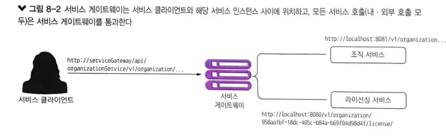
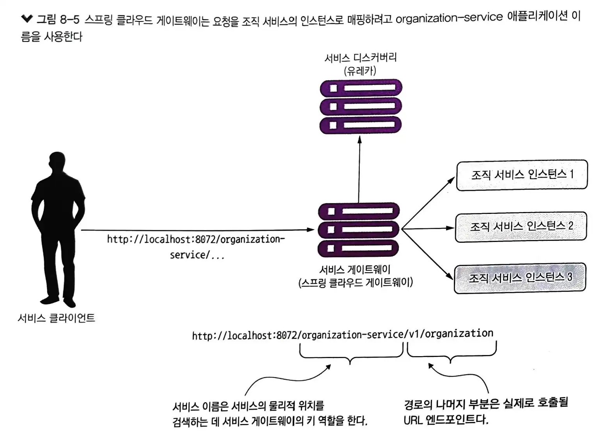
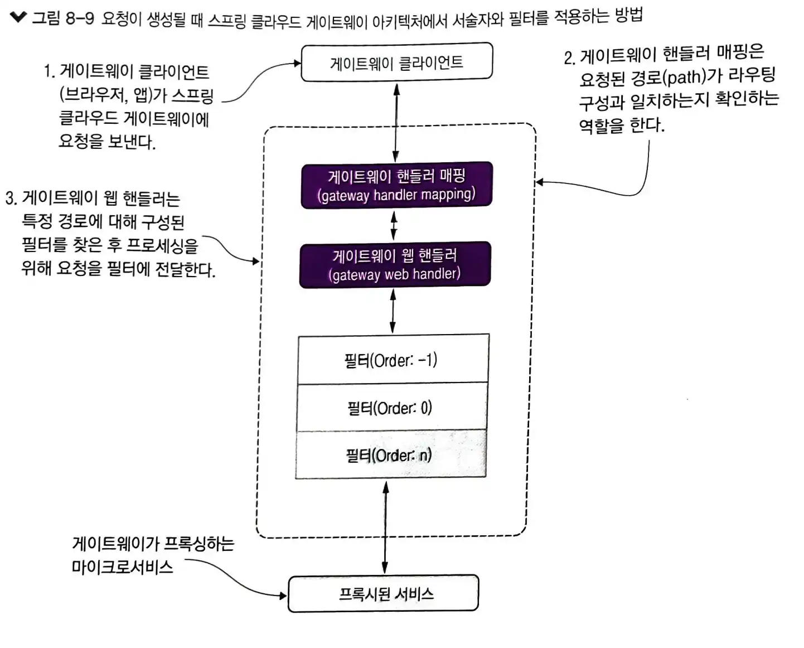
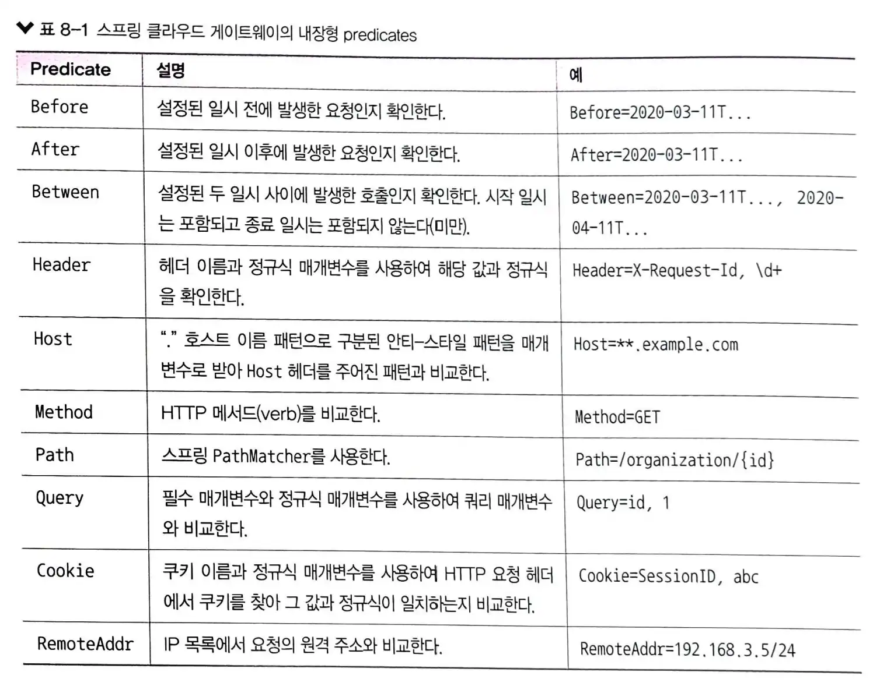
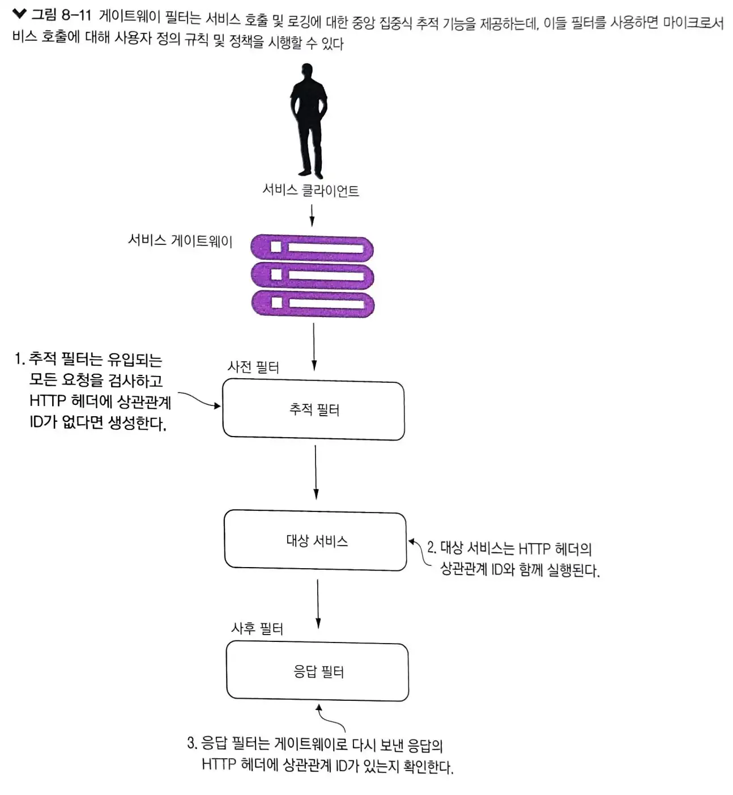
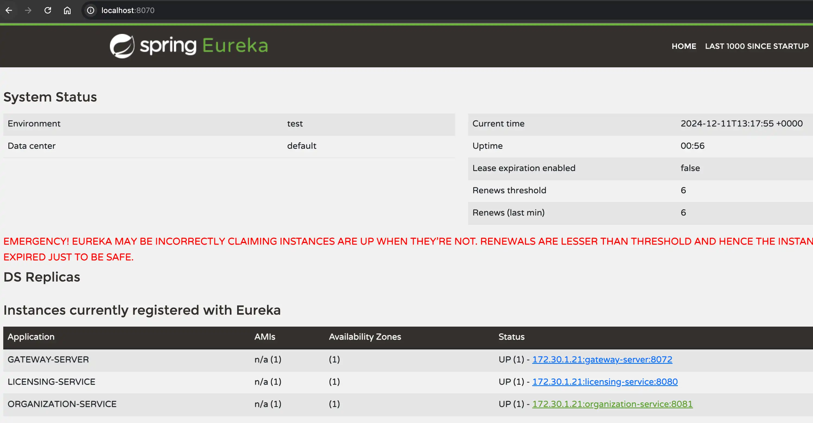
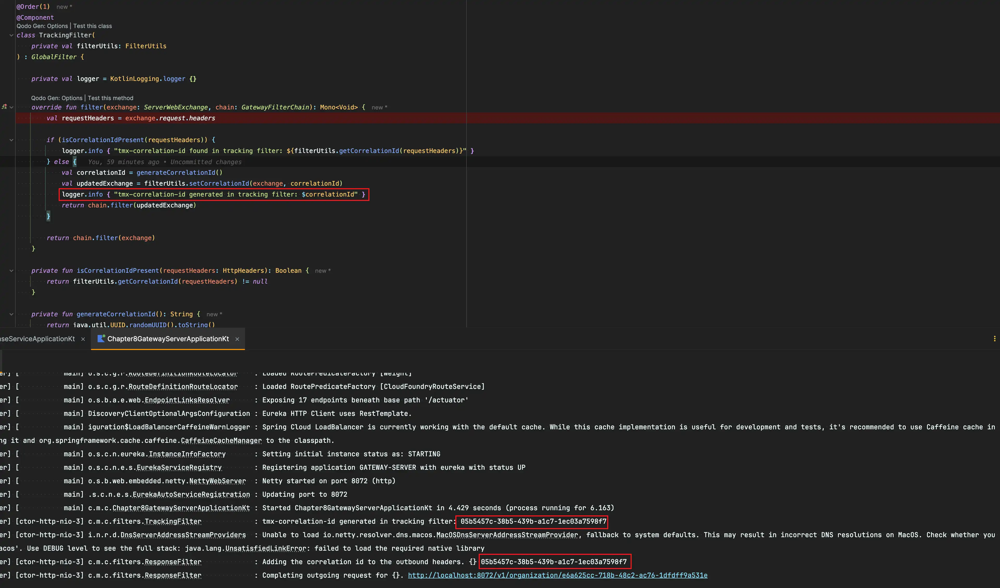
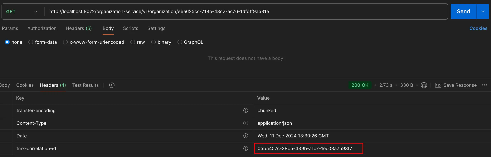
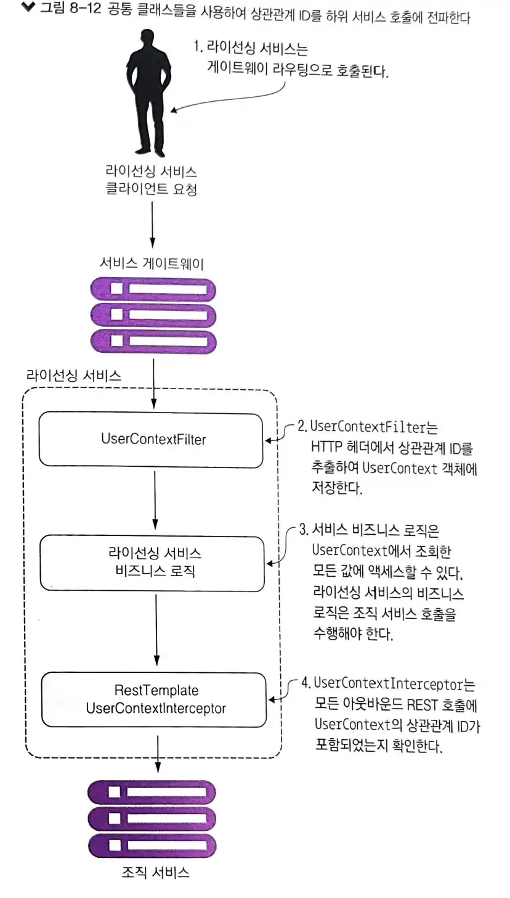

# 8장 스프링 클라우드 게이트웨이를 이용한 서비스 라우팅

마이크로서비스와 같은 분산형 아키텍처에서는 보안과 로깅, 여러 서비스 호출에 걸친 사용자 추적처럼 중요한 작업을 해야 될 수 있습니다.

위의 특성을 일관되게 적용하지 않고 각 서비스에 직접 구축하게되면 아래와 같은 문제가 발생할 수 있습니다.

- 해당 기능을 각 서비스에 일관되게 구현하기 어려움
- 보안과 로깅 같은 횡단 관심사의 구현 책임을 개별 개발 팀에 전가하면 잘못 구현하거나 누락될 수 있음
- 모든 서비스에 걸쳐 강한 의존성을 만들 수 있음

위의 문제를 해결하기 위해 횡단 관심사를 독립적으로 배치할 수 있고, 아키텍처의 모든 마이크로서비스 호출에 대한 필터와 라우터 역할을 할 수 있게 서비스로 추상화 할 수 있습니다.

위의 방법을 서비스로 추상화 한 것이 게이트웨이 라고 합니다. 서비스 클라이언트들의 모든 호출은 단일 정책 시행 지점 역할을 하는 게이트웨이를 경유한 다음 최종 목적지로 라우팅합니다.

스프링 클라우드 게이트웨이를 사용한 서비스 방법은 아래와 같습니다.

- 하나의 URL 뒤에 모든 서비스를 배치하고 서비스 디스커버리를 사용하여 해당 홏루을 실제 서비스 인스턴스에 매핑하는 방법
- 서비스 게이트웨이를 경유하는 모든 서비스 호출에 상관관계 ID를 삽입하는 방법
- HTTP 응답을 전달받은 상관관계 ID를 삽입하여 클라이언트로 재전송하는 방법

## 8.1 서비스 게이트웨이란?

서비스 게이트웨이는 서비스 클라이언트와 호출되는 서비스 사이에서 중개 역할을 하고, 서비스 게이트웨이가 관리하는 하나의 URL로 통신합니다.



서비스 게이트웨이는 애플리케이션 내 마이크로서비스를 호출하기 위해 유입되는 모든 트래픽의 게이트키퍼 역할을 합니다.  
또한, 게이트웨이는 중앙 정책 시행 지점의 역할도 하기 때문에 각 개발 팀이 횡단 관심사를 구현하지 않고 한곳에서 수행할 수 있습니다.

횡단 관심사의 예

- 정적 라우팅: 서비스 게이트웨이는 단일 서비스 URL과 API 경로로 모든 서비스를 호출
- 동적 라우팅: 서비스 게이트웨이는 유입되는 서비스 요청을 검사하고 요청 데이터를 기반으로 서비스 호출자를 위한 지능적 라우팅을 수행할 수 있음
  - 베타 프로그램에 참여하는 고객의 서비스 호출은 사람들이 사용하는 버전과 다른 버전의 코드가 실행되는 특정 서비스 클러스터로 라우팅
- 인증과 인가: 모든 서비스 호출이 서비스 게이트웨이로 라우팅 되기 때문에 서비스 게이트웨이는 서비스 호출자가 자신의 인증 여부를 확인할 수 있는데 적합
- 지표 수집과 로깅: 서비스 호출이 게이트웨이를 통과하기 때문에 서비스 게이트웨이를 지표와 로그를 수집하는 데 사용할 수 있음

주의할 점

서비스 게이트웨이도 올바르게 구현되지 않는다면 동일한 위험이 발생할 수 있으니 구현 시 다음 사항을 염두에 해야 합니다.

- 로드 밸런서는 서비스 앞에 있을 때 유용
  - 로드 밸런서를 여러 서비스 게이트웨이 인스턴스 앞에 두는 것은 적절한 설계이며, 필요할 때 서비스 게이트웨이 구현체를 확장할 수 있음
  - 하지만 모든 서비스 인스턴스 앞에 로드 밸런서를 두는 것은 병목점이 될 수 있어 좋은 생각이 아님(서비스 디스커버리를 사용하지 않고 자동 확장을 고려한다면 서비스 그룹 앞에 로드 밸런서를 배치하는 것이 가장 일반적인 접근법)
- 서비스 게이트웨이를 무상태로 작성
  - 어떤 정보도 서비스 게이트웨이의 메모리에 저장하면 안됨(주의하지 않으면 게이트웨이의 확장설을 제한할 수 있음)
  - 데이터는 모든 서비스 게이트웨이 인스턴스에 복제되어야 함

## 8.2 스프링 클라우드 게이트웨이 소개

스프링 클라우드 게이트웨이는 스프링 프레임워크 5, 프로젝트 리액터, 스프링 부트2.0을 기반으로 한 API 게이트웨이 구현체입니다.

스프링 클라우드 게이트웨이는 다음 기능들을 제공합니다.

- 애플리케이션의 모든 서ㅣㅂ스 경로를 단일 URL에 매핑
- 게이트웨이로 유입되는 요청과 응답을 검사하고 조치를 취할 수 있는 필터를 작성
- 요청을 실행하거나 처리하기 전에 해당 요청이 주어진 조건을 충족하는지 확인할 수 있는 서술자 제공

### 8.2.2 유레카와 통신하는 스프링 클라우드 게이트웨이 구성

스프링 컨피그 서비스에 게이트웨이 서비스를 위한 구성 파일을 생성합니다.

## 8.3 스프링 클라우드 게이트웨이에서 라우팅 구성

스프링 클라우드 게이트웨이는 본래 리버스 프록시입니다. 리버스 프록시는 자원에 도달하려는 클라이언트와 자원 사이에 위치한 중개 서버입니다.  
클라이언트는 어떤 서버와 통신하고 있는지도 알지 못하며, 리버스 프록시는 클라이언트의 요청을 캡처한 후 클라이언트를 대신하여 원격 자원을 호출합니다.

상위 서비스와 통신하려면 게이트웨이는 유입된 호출이 상위 경로에 매핑하는 방법을 알아야합니다.  스프링 클라우드 게이트웨이에서는 이를 수행할 수 있는 몇 가지 메커니즘을 제공합니다.

- 서비스 디스커버리를 이용한 자동 경로 매핑
- 서비스 디스커버리를 이용한 수동 경로 매핑

### 8.3.1 서비스 디스커버리를 이용한 자동 경로 매핑

gateway-server 구성 파일에 구성 정보를 추가해서 서비스 ID를 기반으로 요청을 자동으로 라우팅 할 수 있습니다.

``` yaml
spring:
  cloud:
    gateway:
      discovery.locator: # 서비스 디스커버리에 등록된 서비스를 기반으로 게이트웨이가 경로를 생성하도록 설정
        enabled: true
        lowerCaseServiceId: true
```



유레카와 함께 스프링 클라우드 게이트웨이를 사용하는 장점은 호출할 수 있는 엔드포인트가 하나라는 사실 외에 게이트웨이를 수정하지 않고도 서비스 인스턴스를 추가 및 제거할 수 있다는 것입니다.

<http://localhost:8072/actuator/gateway/routes> 를 통해 게이트웨이 경로 매핑 정보를 확인할 수 있습니다.

### 8.3.2 서비스 디스커버리를 이용한 수동 경로 매핑

스프링 클라우드 게이트웨이는 유레카 서비스 ID로 생성된 자동화된 경로에만 의존하지 않고 명시적으로 경로 매핑을 정의할 수 있어 코드를 더욱 세분화 할 수 있습니다.

또한, spring.cloud.gateway.discovery.locator 항목을 제거해야 자동 매핑을 하지 않을 수 있습니다. 자동 라우팅 사용 여부는 신중하게 고려해야 하며, 새로운 서비스가 많이 추가되지 않는
안정적인 환경에서 수동으로 경로를 추가하는 것은 단순하지만, 대규모 환경에서 새로운 서비스가 많다면 지루한 작업이 될 수 있습니다.

### 8.3.3 동적으로 라우팅 구성을 재로딩

동적인 라우팅 재로딩 기능은 게이트웨이 서버의 재시작 없이 경로 매핑을 변경 할 수 있기 때문에 유용합니다.

스프링 액츄에이터를 이용해 git 또는 vault에 구성 정보를 변경 후 actuator/gateway/refresh 를 호출하면 /routes 에 새로운 경로를 확인할 수 있습니다.

## 8.4 스프링 클라우드 게이트웨이의 진정한 능력: Predicate과 Filter Factories

게이트웨이로 모든 요처을 프록시 할 수 있기 때문에 서비스 호출을 단순화 할 수 있습니다. 게이트웨이를 이용하면 모든 서비스에서 보안, 로깅, 추적 등 일관된 애플리케이션 정책을 적용하기 위해 이러한 사용자 정의 로직을 사용할 수 있습니다.

애플리케이션 정책 전략을 구현하기 위해 애플리케이션의 각 서비슬르 수정하지 않고 모든 서비스에 적용하길 원하기 때문에 이러한 애플리케이션 정책들은 횡단 관심사로 간주됩니다.



### 8.4.1 게이트웨이 Predicate Factories

게이트웨이의 서술자는 요청을 실행하거나 처리하기 전에 요청이 조건 집합을 충족하는지 확인하는 객체입니다.

경로마다 논리 AND로 결합할 수 있는 여러 Predicate Factories를 설정할 수 있습니다.



### 8.4.2 게이트웨이 Filter Factories

게이트웨이의 Filter Factories를 사용하면 코드에 정책 시행 지점을 삽입하여 모든 서비스 호출에 대해 일관된 방식으로 작업을 수행할 수 있습니다.  
이러한 필터를 이용해 수신 및 발신하는 HTTP 요청과 응답을 수정할 수 있습니다.


### 8.4.3 사용자 정의필터

게이트웨이를 경유하는 모든 요청을 프록시하는 기능을 사용하여 서비스 호출을 단순화할 수 있습니다. 하지만 스프링 클라우드 게이트웨이의 진정한 강점은 게이트웨이를 통과하는 모든 서비스 호출에 적용될 수 있는 사용자 정의 로직을 작성하려고 할 때 발휘됩니다.

스프링 클라우드 게이트웨이는 다음 두 가지 종류의 필터를 지원합니다.

- 사전 필터: 실제 요청이 목적지로 전송되기 전에 사전 필터가 호출
  - 사전 필터는 일반적으로 서비스가 일관된 메시지 형식인지 확인하는 작업(http 헤더 존재 여부 확인)을 수행
  - 서비스 호출하는 사용자가 인증되었는지 확인하는 게이트키퍼 역할
- 사후 필터: 사후 필터는 대상 서비스 이후에 호출되고 응답은 클라이언트로 다시 전송
  - 일반적으로 대상 서비스의 응답을 다시 기록하거나 오류를 처리하거나 민감한 정보에 대한 응답을 검사하려고 사후 필터 구현



- 추적 필터
  - 추적 필터는 게이트웨이로 들어오는 모든 요청과 연관된 상관관계 ID가 있는지 확인하는 사전 필터
  - 상관관계 ID는 고객 요청을 수행할 때 실행되는 모든 마이크로서비스에 걸쳐 전달되는 고유 ID
  - 상관관계 ID를 사용하면 호출이 이련의 마이크로서비스를 통과할 때 발생하는 이벤트 체인 추적 가능
- 대상 서비스
  - 대상 서비스는 조직 또는 라이선스 서비스 일 수 있음
  - 두 서비스 모두 HTTP 요청 헤더에서 상관관계 ID를 받음
- 응답 필터
  - 응답 필터는 서비스 호출과 연관된 상관관계 ID를 클라이언트 전송될 HTTP 응답 헤더에 삽입하는 사후 필터
  - 이 방식으로 클라이언트로 요청과 연결된 상관관계 ID에 엑세스 가능

## 8.5 사전 필터 만들기

게이트웨이로 유입되는 모든 요청을 검사하고, 요청에서 tmx-correlation-id라는 HTTP 헤더의 포함 여부를 확인하는 TrackingFilter라는 사전 필터를 만듭니다.

tmx-correlation-id 헤더에는 여러 마이크로서비스를 거쳐 사용자 요청을 추적하는 데 사용되는 고유한 GUID(Globally Universal ID)가 포함됩니다.

- tmx-correlation-id가 HTTP 헤더에 없으면 게이트웨이 TrackingFilter가 상관관계 ID를 생성하고 설정
- 상관관계 ID가 이미 있다면 게이트웨이는 아무 일도 하지 않음(상관관계 ID가 있다는 것은 해당 서비스 호출이 사용자 요청을 수행하는 서비스 호출 체인의 한 부분이라는 것을 의미)

FilterUtils의 setCorrelationId() 메서드를 사용하여 HTTP 요청 헤더에 값을 추가하려고 할 때 ServerWebExchange.Builder의 mutate() 메서드를 사용할 수 있습니다.  
해당 메서드는 교환 객체를 ServerWebExchangeDecorator로 래핑하고, 변경된 값을 반환하거나 이 인스턴스에 다시 위임하여 교환 객체의 프로퍼티를 변경하는 빌더를 반환합니다.







## 8.6 서비스에서 상관관계 ID 사용

게이트웨이를 통과하는 모든 마이크로서비스 호출에 상관관계 ID를 통해 아래의 사항을 확인할 수 있습니다.

- 상관관계 ID는 호출된 마이크로서비스가 쉽게 액세스할 수 있음
- 마이크로서비스로 수행될 모든 하위 서비스 호출에도 상관관계 ID가 전파됨



1. 게이트웨이로 라이선싱 서비스를 호출할 때 TrackingFilter는 게이트웨이로 유입되는 모든 호출에 대해 상관관계 ID를 삽입합니다.
2. 사용자가 정의할 수 있는 HTTP ServletFilter인 UserContextFilter 클래슨느 상관관계 ID를 UserContext 클래스에 매핑하며,UserContext 클래스는 해당 호출의 나중 부분에서 사용될 것을 대비하여 그 값을 스레드에 저장합니다.
3. 라이선싱 서비스의 비즈니스 로직은 로직 서비스에 대한 호출을 실행합니다.
4. RestTemplate은 조직 서비스를 호출하며, RestTemplate은 사용자 정의 스프링 인터셉터 클래스는 UserContextIneterceptor를 사용하여 상관관계 ID를 아웃바운드 호출의 HTTP 헤더에 삽입합니다.

중복된 코드 vs 공유 라이브러리

필자의 의견: 인프라스트럭처 종류의 작업을 처리할 때 공유라이브러리는 적합합니다. 하지만 비즈니스 중심의 클래스를 공유하기 시작하면 서비스 사이의 경계를 허물기 때문에 문제가 발생할 수 있습니다.

### 8.6.1 유입되는 HTTP 요청을 가로채는 UserContextFilter

UserContextFilter 클래스는 서비스로 들어오는 모든 HTTP 요청을 가로채고, HTTP 요청에서 사용자 컨텍스트 클래스로 상관관계 ID를 매핑하는 HTTP 서블릿 필터입니다.

### 8.6.2 서비스에 쉽게 액세스할 수 있는 HTTP 헤더를 만드는 UserContext

UserContext 클래스는 마이크로서비스가 처리하는 각 서비스 클라이언트 요청의 HTTP 헤더값을 보관합니다. UserContextHolder로 ThreadLocal 변수에 UserContext 저장합니다.

### 8.6.3 상관관계 ID 전파를 위한 사용자 정의 RestTemplate과 UserContextInterceptor

UserContextInterceptor 클래스는 RestTemplate 인스턴스에서 실행되는 모든 HTTP 기반 서비스 발신 요청에 상관관계 ID를 주입합니다.

이 작업은 서비스 호출 간 링크를 설정하는데 수행되며, 이를 위해 RestTemplate 클래스에 주입된 스프링 인터셉터를 사용합니다.

UserContextInterceptor를 사용하려면 RestTemplate 빈을 정의 후 UserContextInterceptor 클래스에 해당 빈을 정의해야합니다.

## 8.7 상관관계 ID를 수신하는 사후 필터 작성

사전 필터에서 데이터를 캡처하는 것과 연관되었다면 게이트웨이 사후 필터는 지표를 수집하고 사용자의 트랜잭션과 관련된 모든 로깅을 완료하는데 이상적인 위치입니다.
